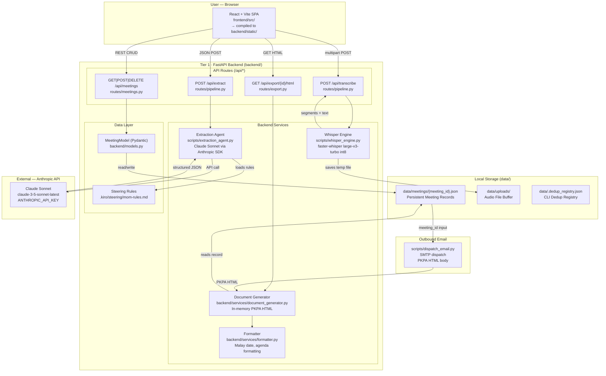

# Design Document: Penjana Minit Mesyuarat

## Overview

**Penjana Minit Mesyuarat** is a local-first, privacy-preserving web platform for Malaysian Public Sector meeting administration. It ingests raw meeting audio or transcript files, extracts structured meeting data using Claude Sonnet (via direct Anthropic API), persists records as flat-file JSON, and renders official documents compliant with **PKPA Bilangan 2 Tahun 1991**.

The platform is a two-tier system:

- **Tier 1 — Local Processing Backend:** A FastAPI REST service orchestrating a local `faster-whisper` speech-to-text engine and a Claude Sonnet extraction agent. All meeting data is stored on-disk under `data/`.
- **Tier 2 — Web UI:** A React + Vite SPA served directly by the FastAPI process, providing four functional views over the backend API.

> **Deprecated and removed:** Amazon Quick Automate, Quick Flows, Quick Spaces, `dispatch_quick.py`, `upload_to_space.py`, AWS Bedrock, and `boto3`. The downstream delivery mechanism is email (`scripts/dispatch_email.py`).

---

## Architecture

### High-Level Component Diagram



### Data Flow: Ingest → Extract → Save → Export

```
[Browser] Upload audio/.txt
    → POST /api/transcribe
        → faster-whisper (local, int8)
        → { transcript, segments_count }
    → [User reviews transcript in IngestView]
    → POST /api/extract  { transcript }
        → Extraction Agent
            → load .kiro/steering/mom-rules.md
            → Anthropic API (Claude Sonnet)
            → structured { participants, agenda_items, decisions, action_items }
    → [User edits in EditorView]
    → POST /api/meetings/save  { MeetingModel }
        → data/meetings/{meeting_id}.json  (atomic write)
    → GET /api/export/{meeting_id}/html
        → document_generator.py (in-memory)
        → PKPA Bil. 2/1991 HTML  (browser print → PDF)
```

### Subsystem Responsibilities

| Subsystem | File | Primary Responsibility |
|---|---|---|
| FastAPI App | `backend/app.py` | Route registration, static file serving, CORS |
| Pipeline Routes | `backend/routes/pipeline.py` | `/api/transcribe`, `/api/extract` |
| Meetings Routes | `backend/routes/meetings.py` | Full CRUD on `data/meetings/` |
| Export Routes | `backend/routes/export.py` | PKPA HTML generation endpoint |
| Whisper Engine | `scripts/whisper_engine.py` | Local STT via faster-whisper |
| Extraction Agent | `scripts/extraction_agent.py` | Anthropic API call, steering rules, schema output |
| Document Generator | `backend/services/document_generator.py` | In-memory PKPA Bil. 2/1991 HTML |
| Formatter | `backend/services/formatter.py` | Malay date formatting, agenda normalisation |
| Email Dispatch | `scripts/dispatch_email.py` | SMTP-based finalized minutes distribution |
| CLI Runner | `scripts/run_pipeline.py` | Headless batch processing, dedup, write |

---

## Components and Interfaces

### 1. FastAPI Application (`backend/app.py`)

The root FastAPI application:

- Registers three modular routers: `pipeline`, `meetings`, `export`.
- Mounts the compiled React bundle from `backend/static/` at root `/` using `StaticFiles(html=True)`, so all non-`/api` paths fall through to `index.html`.
- Applies `CORSMiddleware` (dev: `allow_origins=["*"]`; prod: restrict to localhost).
- Entrypoint: `uvicorn backend.app:app --reload --port 8000`.

### 2. Pipeline Routes (`backend/routes/pipeline.py`)

#### `POST /api/transcribe`

- Accepts `multipart/form-data` with a single `file` field (`.mp3`, `.wav`, `.m4a`, `.txt`).
- Saves the file to `data/uploads/{uuid8}_{filename}`.
- Instantiates `MeetingTranscriber(model_size="large-v3-turbo")` (singleton at module level to avoid repeated model loads).
- Calls `transcriber.stream_transcribe(path)`, collects all segments, concatenates `.text` fields into `transcript`.
- Returns `{ status, filename, transcript, segments_count }`.
- On exception: raises `HTTPException(500, detail="Ralat transkripsi: ...")`.

#### `POST /api/extract`

- Accepts `{ "transcript": "<text>" }` JSON body (`ExtractPayload` Pydantic model).
- Guards against empty transcript (400, `"Transkrip kosong."`).
- Calls `run_extraction(payload.transcript)`.
- Returns `{ status: "success", data: <MoM_Schema_object> }`.

### 3. Meetings Routes (`backend/routes/meetings.py`)

| Method | Path | Behaviour |
|---|---|---|
| `GET` | `/api/meetings` | Glob `data/meetings/*.json`, parse all, return array |
| `GET` | `/api/meetings/{id}` | Read single file; 404 if missing |
| `POST` | `/api/meetings/save` | Accept `MeetingModel`; assign `meet_{hex8}` id if absent; write UTF-8 JSON with `indent=2, ensure_ascii=False` |
| `DELETE` | `/api/meetings/{id}` | Unlink file; 404 if missing |

`data/meetings/` is created with `mkdir(parents=True, exist_ok=True)` on module load.

### 4. Export Routes (`backend/routes/export.py`)

#### `GET /api/export/{meeting_id}/html`

- Reads `data/meetings/{meeting_id}.json`.
- Passes the parsed dict to `generate_official_mom_html(meeting)`.
- Returns the HTML string as `HTMLResponse`.

### 5. Whisper Engine (`scripts/whisper_engine.py`)

```python
class MeetingTranscriber:
    def __init__(self, model_size="large-v3-turbo", device="auto"):
        compute = "default" if device == "cuda" else "int8"
        self.model = WhisperModel(model_size, device=device, compute_type=compute)

    def stream_transcribe(self, audio_path: str) -> Iterator[dict]:
        # yields { id, start, end, text, time_str }
        # settings: language=None (auto), temperature=[0.0..1.0], vad_filter=True
```

**Model selection rationale:** `large-v3-turbo` with `int8` quantization provides high multilingual accuracy (BM/EN/Manglish) at low memory footprint on CPU. `vad_filter=True` eliminates dead-air looping artefacts common in meeting recordings.

### 6. Extraction Agent (`scripts/extraction_agent.py`)

**Entry point:** `run_extraction(transcript_input: str | Path) -> dict`

Accepts either a file path (reads from disk) or raw string (in-memory from `/api/extract`).

**Execution sequence:**

```
1. Detect input type (Path on disk vs. raw string)
2. load_steering_rules(.kiro/steering/mom-rules.md)
3. count_words(transcript) → if < 50: return near-empty partial result
4. extract_meeting_date(filename_or_text, transcript) → YYYY-MM-DD or null
5. Build system_prompt:
       "You are a professional MoM extraction engine..."
       + SCHEMA_CONTRACT (inline, ≤300 tokens)
       + RULES: {{ steering_rules_content }}
6. Build user_prompt:
       TRANSCRIPT_SEGMENT: {{ transcript_text }}
       MEETING_DATE_HINT: {{ date or null }}
       SOURCE_FILE: {{ source_label }}
       CHUNK_INDEX: 1 of 1
7. call_llm(system_prompt, user_prompt)
       → anthropic.Anthropic(api_key=ANTHROPIC_API_KEY)
       → client.messages.create(model="claude-3-5-sonnet-latest", max_tokens=8192)
       → parse JSON from response (json_repair fallback)
8. Wrap in full MoM_Schema envelope with extraction_metadata
9. Return structured dict
```

**LLM client:** Direct `anthropic` Python SDK. No boto3, no Bedrock, no AWS credentials.

**JSON repair:** Uses `json_repair.loads()` as fallback if `json.loads()` fails (handles LLM fence artifacts).

**Near-empty guard:** If `count_words(transcript) < rules["near_empty_word_threshold"]` (default 50), returns immediately with `extraction_status: "partial"`, `near_empty: true`, all arrays `[]`.

**Error handling:**

| Failure | Behaviour |
|---|---|
| `ANTHROPIC_API_KEY` absent | `RuntimeError` → 500 from route |
| API returns non-JSON | `json_repair` fallback; if still fails, reraise |
| API error / network | Logged; `RuntimeError` propagated to route → 500 |
| Near-empty transcript | Partial result; no API call made |

### 7. Document Generator (`backend/services/document_generator.py`)

**Function:** `generate_official_mom_html(meeting: dict) -> str`

Produces a complete, standalone HTML document string in-memory. No disk templates are read.

**PKPA Bil. 2/1991 layout elements:**

| Element | Specification |
|---|---|
| Font | Times New Roman, 12pt body |
| Title | `<h1>` uppercase, centred |
| Bilangan | `<h2>` normal weight, centred |
| Metadata table | Tarikh, Masa, Tempat, Pengerusi — 2-column label:value layout |
| Section divider | `<hr>` 1px solid #999 |
| Action items table | 4 columns: Bil · Perkara/Tindakan · Tindakan Oleh · Tarikh Akhir |
| Print styling | `@media print { .no-print { display: none; } body { margin: 20mm; } }` |
| Print button | Visible on screen, hidden on print; calls `window.print()` |

**Date formatting:** Delegates to `formatter.format_malay_date(date_str)` → `"15 Januari 2025"`.

### 8. Email Dispatch (`scripts/dispatch_email.py`) — *Pending Implementation*

**Module structure (target):**

```python
def load_meeting(meeting_id: str) -> dict       # reads data/meetings/{id}.json
def build_email(meeting: dict) -> MIMEMultipart # HTML body + plain-text fallback
def send_with_retry(msg, recipients) -> None    # SMTP with 3 retries, 5s delay
def main() -> None                              # CLI entry; sys.exit(0|1)

SMTP_CONFIG_KEYS = ["SMTP_HOST", "SMTP_PORT", "SMTP_USER",
                    "SMTP_PASSWORD", "SMTP_FROM"]
RETRY_DELAYS = [5, 5, 5]   # seconds between retry attempts
```

**Environment variables (all required):**

| Variable | Description |
|---|---|
| `SMTP_HOST` | SMTP server hostname |
| `SMTP_PORT` | SMTP port (587 for STARTTLS, 465 for SSL) |
| `SMTP_USER` | SMTP authentication username |
| `SMTP_PASSWORD` | SMTP authentication password |
| `SMTP_FROM` | Sender address shown to recipients |

**CLI invocation:** `python scripts/dispatch_email.py <meeting_id> <recipient1@...> [recipient2@...] ...`

**Exit codes:**

| Condition | Exit code |
|---|---|
| All emails sent successfully | `0` |
| Missing SMTP config variable | `1` (no send attempted) |
| Meeting record not found | `1` |
| All retries exhausted | `1` |

---

## Data Models

### `MeetingModel` (Pydantic — `backend/models.py`)

```python
class ActionItemModel(BaseModel):
    task: str
    assignee: Optional[str] = "Belum Ditetapkan"
    deadline: Optional[str] = "-"
    status: Optional[str] = "Belum Mula"
    # status values: "Belum Mula" | "Sedang Berjalan" | "Selesai" | "Tertunggak"

class MeetingModel(BaseModel):
    id: Optional[str] = None           # meet_{8-char hex}, assigned by server
    meeting_title: str
    meeting_number: Optional[str] = ""
    location: Optional[str] = ""
    date: Optional[str] = ""           # YYYY-MM-DD
    start_time: Optional[str] = ""
    end_time: Optional[str] = ""
    chairperson_name: Optional[str] = ""
    chairperson_role: Optional[str] = ""
    status: Optional[str] = "Draf"    # "Draf" | "Selesai"
    action_items: List[ActionItemModel] = []
    raw_transcript: Optional[str] = ""
```

### `MoM_Schema` (Extraction Output)

The extraction agent returns this envelope wrapping the Anthropic output:

```json
{
  "schema_version": "1.0.0",
  "meeting_id": "<uuid4>",
  "meeting_date": "YYYY-MM-DD | null",
  "source_file": "<path or 'in-memory-transcript'>",
  "participants": [
    {
      "label": "Full Name",
      "department": "Canonical Department | null",
      "department_confidence": "explicit | inferred | unresolved | null",
      "label_source": "explicit | inferred"
    }
  ],
  "agenda_items": [
    {
      "id": "agenda-001",
      "title": "Topic title",
      "confidence": "explicit | inferred",
      "summary": "Concise factual summary"
    }
  ],
  "decisions": [
    {
      "id": "decision-001",
      "statement": "Agreed decision text",
      "confidence": "explicit | inferred",
      "speaker_label": "Speaker Name | null",
      "agenda_item_id": "agenda-001 | null"
    }
  ],
  "action_items": [
    {
      "id": "action-001",
      "description": "Actionable task (max 500 chars)",
      "assignee": "Speaker Name | null",
      "assignee_status": "resolved | unresolved",
      "deadline": "YYYY-MM-DD | null",
      "deadline_status": "resolved | missing | unresolvable",
      "agenda_item_id": "agenda-001 | null",
      "raw_text": "Original utterance | null",
      "normalisation_confidence": "high | low | null"
    }
  ],
  "extraction_metadata": {
    "extracted_at": "YYYY-MM-DDTHH:MM:SSZ",
    "pipeline_version": "1.0.0",
    "language_detected": ["ms", "en"],
    "warnings": [],
    "rules_version": "1.0.0",
    "token_usage": { "input_tokens": 0, "output_tokens": 0 },
    "extraction_status": "success | partial | failed | error",
    "near_empty": false
  }
}
```

### Meeting Record on Disk (`data/meetings/{meeting_id}.json`)

Each persisted file is the serialized `MeetingModel.dict()` written as UTF-8 JSON with `indent=2, ensure_ascii=False`. Example:

```json
{
  "id": "meet_a1b2c3d4",
  "meeting_title": "Mesyuarat Jawatankuasa Teknikal Bil. 3/2025",
  "meeting_number": "3/2025",
  "location": "Bilik Mesyuarat Utama, Aras 4",
  "date": "2025-09-18",
  "start_time": "09:00",
  "end_time": "11:30",
  "chairperson_name": "Dato' Ahmad Faizal bin Hj. Ismail",
  "chairperson_role": "Pengarah Bahagian ICT",
  "status": "Draf",
  "action_items": [
    {
      "task": "Sediakan laporan analisis kos migrasi awan untuk pembentangan",
      "assignee": "Siti Nabilah",
      "deadline": "2025-09-25",
      "status": "Belum Mula"
    }
  ],
  "raw_transcript": ""
}
```

---

## Frontend Architecture

### Technology Stack

| Layer | Technology | Version |
|---|---|---|
| Framework | React | 19.x |
| Build Tool | Vite | 8.x |
| Styling | Tailwind CSS | 4.x |
| Icons | lucide-react | 1.x |
| Language | JSX (ES modules) | — |

### Project Structure

```
frontend/
├── src/
│   ├── main.jsx            # React root mount
│   ├── App.jsx             # Root component, view router, global state
│   ├── App.css
│   ├── index.css
│   └── components/
│       ├── Header.jsx      # App-wide top bar
│       ├── Navigation.jsx  # Tab bar (History / Tracker / Ingest / + Baru)
│       ├── HistoryView.jsx # Executive Dashboard
│       ├── TrackerView.jsx # Action Item Tracker
│       ├── IngestView.jsx  # Audio Upload & AI Extraction
│       └── EditorView.jsx  # MoM Editor & PKPA Preview
├── index.html
├── package.json
└── vite.config.js
```

### Application State (`App.jsx`)

| State | Type | Description |
|---|---|---|
| `view` | `string` | Active view: `'history'` · `'tracker'` · `'ingest'` · `'editor'` |
| `meetings` | `array` | All meeting records, loaded on mount from `GET /api/meetings` |
| `currentMeeting` | `object \| null` | Meeting being edited or previewed |
| `previewMode` | `boolean` | `true` = PKPA preview, `false` = edit form |

**View transitions:**

```
history → editor     : handleSelectMeeting (previewMode: true)
                       handleEditMeeting   (previewMode: false)
                       handleNewMeeting    (blank record, previewMode: false)
ingest  → editor     : onExtracted(data)  (previewMode: false)
editor  → history    : onBack() + fetchMeetings()
```

### Component Specifications

#### `HistoryView`

**Props:** `{ meetings, onSelectMeeting, onEditMeeting, onDeleteMeeting }`

**Layout:**
- KPI tile row: **Jumlah Minit** (total), **Draf**, **Selesai** — derived from `meetings` prop.
- Search input: filters `meetings` in real time across `meeting_title`, `chairperson_name`, `location`, `date`. Filter is client-side (no API call).
- Status filter pills: **Semua** · **Draf** · **Selesai**. Combined with search.
- Meeting card list: one card per record showing title, number, date, location, chairperson, status badge, and action buttons:
  - **Lihat** → `onSelectMeeting(id)` → `EditorView` (previewMode: true)
  - **Sunting** → `onEditMeeting(id)` → `EditorView` (previewMode: false)
  - **Padam** → `window.confirm(...)` → `onDeleteMeeting(id)` → `DELETE /api/meetings/{id}`
- Empty state: Malay-language prompt with "Cipta Minit Baru" CTA when `meetings.length === 0`.

#### `TrackerView`

**Props:** `{ meetings, onBack }`

**Layout:**
- KPI counter row: **Jumlah**, **Belum Mula**, **Sedang Berjalan**, **Tertunggak** — aggregated from `meetings[*].action_items`.
- Completion percentage bar: `(Selesai count / total) * 100%`, rendered as a filled progress bar.
- Per-status distribution section: colour-coded count tiles for each `ActionItemModel.status` value.
- Action item list: grouped by source meeting, showing `task`, `assignee`, `deadline`, `status` badge.

**Data source:** Client-side aggregation from `meetings` prop. No additional API calls.

#### `IngestView`

**Props:** `{ onExtracted, onBack }`

**Layout:**

1. **File Dropzone** — Accepts `.mp3`, `.wav`, `.m4a`, `.txt` via drag-and-drop or click-to-browse. On file selection:
   - Audio files → `POST /api/transcribe` (FormData); shows spinner with "Sedang mentranskrip..." status.
   - `.txt` files → read with `FileReader.readAsText()`; populate transcript textarea directly.
2. **Status feedback** — Shows one of: idle / uploading / transcribing / complete (+ segment count) / error (+ Malay message + retry button).
3. **Transcript editor** — `<textarea>` displaying the transcription result. User can edit before extraction.
4. **Extract button** — "Jana Minit dengan AI" → `POST /api/extract { transcript }`; shows spinner during call.
5. **On success** → calls `onExtracted(data.data)` which routes to `EditorView` with pre-populated fields.

**Internal state:** `{ file, status, transcript, isExtracting, error }`

#### `EditorView`

**Props:** `{ meeting, previewMode, setPreviewMode, onBack }`

**Edit mode layout:**

1. **Metadata section** — Input fields: `meeting_title`, `meeting_number`, `date` (date input), `start_time`, `end_time`, `location`, `chairperson_name`, `chairperson_role`, `status` (select: Draf/Selesai).
2. **Participants manager** — Text input + "Tambah" button; each added name renders as a badge chip with a remove (×) control.
3. **Agenda cards** — Dynamic list of cards, each containing:
   - Title input
   - Discussion/summary textarea
   - Decisions list (add/remove text entries)
   - "Tambah Perkara" button to append a new card; each card has a remove control.
4. **Action items matrix** — Table with per-row inputs: `task` (text), `assignee` (text), `deadline` (date), `status` (select). "Tambah Tindakan" appends a row.
5. **Toolbar** — **Simpan** (→ `POST /api/meetings/save`), **Preview PKPA** toggle, **Balik** (→ `onBack()`).
6. **Save feedback** — Success/error toast in Bahasa Melayu.

**Preview mode layout:**

- Renders an `<iframe src="/api/export/{meeting.id}/html" />` filling the view area, showing the live PKPA Bil. 2/1991 formatted document.
- Toolbar shows only **Edit** toggle and **Balik** button.
- The iframe includes the "Cetak / Simpan PDF" print button from `document_generator.py`.

---

## Backend Services

### `backend/services/document_generator.py`

**Function:** `generate_official_mom_html(meeting: dict) -> str`

Generates a complete standalone HTML page. Key rendering decisions:

- Calls `format_malay_date(meeting["date"])` for the Tarikh field.
- Iterates `meeting["action_items"]` to build the action table rows (1-indexed `Bil`).
- Renders `"Tiada tindakan direkodkan."` if `action_items` is empty.
- Embeds all CSS inline (no external stylesheets) for portability and print reliability.
- `@media print` hides the print button and resets margins to `20mm`.

### `backend/services/formatter.py`

**`format_malay_date(date_str: str) -> str`**
- Input: `"2025-09-18"` → Output: `"18 September 2025"`
- Uses a static Malay month-name dict; falls back to `date_str` on parse error.

**`format_agenda_items(agenda_items: list) -> list`**
- Normalises agenda items for PKPA output: adds 1-based `index`, ensures `title`, `discussion`, and `action_by` fields exist.

---

## Steering Rules File

### File: `.kiro/steering/mom-rules.md`

The steering rules file governs the extraction agent's LLM prompt. Its content is injected verbatim into the Claude system prompt under the `RULES:` section.

**Required front-matter:**

```yaml
---
rules_version: "1.0.0"
inclusion: auto
name: "MoM Extraction Rules"
description: "Extraction rules for the MoM Automation Pipeline"
---
```

**Required sections:** Decision markers (BM + EN + Manglish), action item markers (BM + EN + Manglish), Manglish pragmatic particles (`lah`, `mah`, `lor`, `kan`, `boleh ke`, `tak boleh`), department canonical mappings (8 groups), speaker-change heuristics, token efficiency rules, `near_empty_word_threshold: 50`, chunking config.

**Portability:** The file is structured to be ported verbatim as an Amazon Bedrock system prompt without transformation, enabling future Phase 2 cloud migration.

---

## Deployment

### Development

```bash
# Terminal 1 — Backend
uvicorn backend.app:app --reload --port 8000

# Terminal 2 — Frontend dev server (proxies /api/* to :8000)
cd frontend && npm run dev
```

### Production (Single-Process)

```bash
# Build and deploy frontend bundle
cd frontend && npm run build
cp -r dist/ ../backend/static/

# Serve everything from FastAPI
uvicorn backend.app:app --host 0.0.0.0 --port 8000
```

The `StaticFiles(html=True)` mount in `backend/app.py` serves `index.html` for all non-`/api` paths, enabling client-side routing.

### Environment Variables (`.env`)

| Variable | Required | Description |
|---|---|---|
| `ANTHROPIC_API_KEY` | Yes | Anthropic API key for Claude Sonnet |
| `SMTP_HOST` | For email | SMTP server hostname |
| `SMTP_PORT` | For email | SMTP port (587 / 465) |
| `SMTP_USER` | For email | SMTP auth username |
| `SMTP_PASSWORD` | For email | SMTP auth password |
| `SMTP_FROM` | For email | Sender display address |

---

## Error Handling

### API Error Conventions

All API errors return `{ "detail": "<Malay-language message>" }` with the appropriate HTTP status code.

| Scenario | Status | `detail` |
|---|---|---|
| Empty transcript on extract | 400 | `"Transkrip kosong."` |
| Whisper engine failure | 500 | `"Ralat transkripsi: {reason}"` |
| Extraction agent failure | 500 | `"Ralat pengekstrakan: {reason}"` |
| Meeting not found (get/delete/export) | 404 | `"Minit mesyuarat tidak dijumpai."` |
| `ANTHROPIC_API_KEY` absent | 500 | Key-not-found message in Malay |

### Extraction Agent Error States

| Condition | `extraction_status` | API call made |
|---|---|---|
| < 50 usable words | `"partial"` | No |
| API returns non-JSON; `json_repair` succeeds | `"success"` | Yes (1) |
| All parse attempts fail | `"failed"` | Yes (1–2) |
| Unhandled exception | `"error"` | Maybe |

---

## Architectural Limitations and Future Roadmap

### Current Limitations (v1.0)

| Limitation | Impact |
|---|---|
| Flat-file JSON storage | No concurrent-safe locking; safe for single-user local deployment |
| Single Anthropic API call per transcript | No chunking for very long transcripts (>12k tokens) — chunking is implemented in CLI runner but not the API route |
| Audio buffer not auto-cleaned | `data/uploads/` accumulates files; manual cleanup required until cleanup job is implemented |
| No authentication layer | Platform is open to any user on the local network; suitable for single-machine use only |
| Email dispatch is CLI-only | No in-app send button until `POST /api/dispatch/email/{id}` is implemented |

### Phase 2 — Cloud Migration Target State

When MOTAC production deployment is required:

- **LLM:** Anthropic API is already the production LLM. No change needed for Bedrock migration unless budget policy mandates it; `.kiro/steering/mom-rules.md` can be ported verbatim as a Bedrock system prompt.
- **Storage:** Replace `data/meetings/` flat files with Amazon DynamoDB + S3 archive.
- **Compute:** Wrap the extraction pipeline in an AWS Lambda function triggered by S3 `ObjectCreated` events.
- **STT:** Replace `faster-whisper` with Amazon Transcribe (`ShowSpeakerLabel: true`) for production-grade diarization.
- **Auth:** Add AWS Cognito or Malaysian MyGovID SSO.
