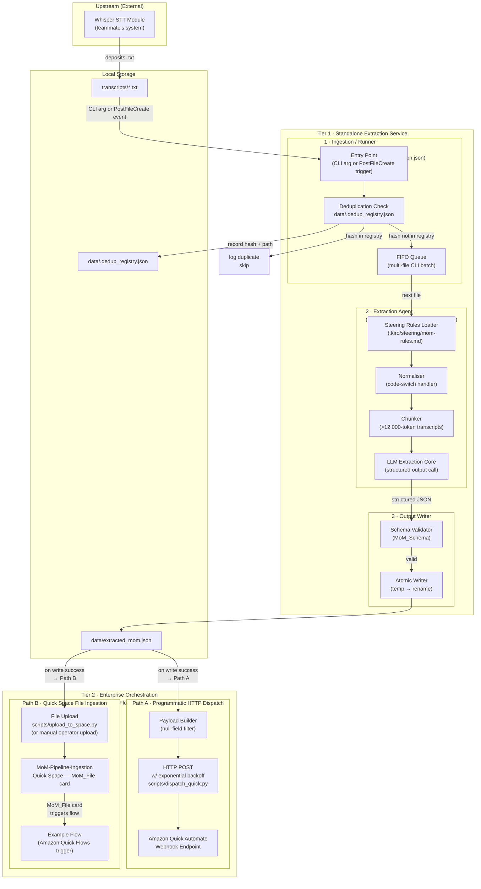
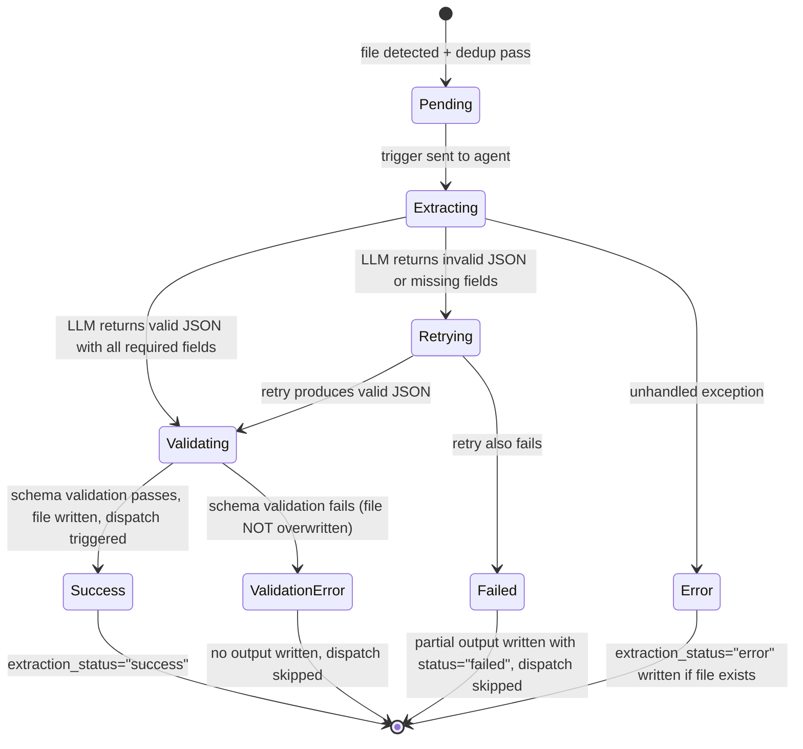

# Design Document: MoM Automation Pipeline

## Overview

The Minutes of Meeting (MoM) Automation Pipeline is a **two-tier, decoupled document processing system** that converts raw speech-to-text transcript files into structured, schema-validated JSON meeting minutes and hands off the result to an enterprise workflow platform.

The pipeline is optimised for multilingual Malaysian workplace transcripts (Bahasa Melayu, English, and Manglish code-switching) produced by an upstream Whisper-based diarization module. The four principal subsystems — Ingestion / Runner, Extraction Agent (with Normaliser), Output Writer, and Dispatch Bridge — are sequenced as a linear pipeline with well-defined failure isolation at each stage.

**Tier 1 — Standalone Extraction Service:** Deduplication check, LLM-backed semantic parsing (via Bedrock/LLM), schema validation, and atomic JSON write. Executable locally via `scripts/run_pipeline.py` or as an AWS Lambda function. Operates entirely independently of the Kiro IDE.

**Tier 2 — Enterprise Orchestration:** Amazon Quick Flows, triggered either by an HTTP POST to the Quick Automate webhook endpoint (`scripts/dispatch_quick.py`) or by file upload to the `MoM-Pipeline-Ingestion` Quick Space (`MoM_File` card → `Example Flow`).

The Kiro Agent Hook (`PostFileCreate`) remains available as a **developer-session convenience trigger** for local iteration. It is not a production runtime dependency. An architectural roadmap (Section 9) defines the migration path toward a fully cloud-native AWS deployment where Kiro is replaced by Amazon Bedrock and AWS Lambda.

---

## Architecture

### High-Level Component Diagram

> **Two-Tier Decoupled Architecture.** Tier 1 (Standalone Extraction Service) operates independently of any IDE session and is the unit that will migrate to AWS Lambda. Tier 2 (Enterprise Orchestration) is Amazon Quick Flows, reachable via two independent handoff paths from Tier 1.



### Data Flow Summary

```
transcripts/*.txt
  → [SHA-256 dedup check]
  → [Steering Rules load]
  → [Normaliser + Chunker]
  → [LLM consolidated extraction call]
  → [Schema validation]
  → data/extracted_mom.json   (atomic write)
  ↓
  ├─ Path A: [Null-field filter] → HTTP POST → Amazon Quick Automate webhook
  └─ Path B: [File upload] → MoM-Pipeline-Ingestion Quick Space (MoM_File) → Example Flow
```

### Subsystem Responsibilities

| Subsystem | Tier | Primary Responsibility | Key State |
|---|---|---|---|
| Ingestion / Runner | 1 | Detect / accept file, deduplicate, queue | `data/.dedup_registry.json` |
| Extraction Agent | 1 | Semantic extraction, normalisation, chunking | LLM API calls |
| Output Writer | 1 | Schema validation, atomic persistence | `data/extracted_mom.json` |
| Dispatch Bridge (Path A) | 2 | HTTP dispatch to Quick Automate, retry, null-field filtering | Exit code, env vars |
| Quick Space Ingestion (Path B) | 2 | File-based event ingestion into Quick Flows via `MoM_File` card | `MoM-Pipeline-Ingestion` Space |

---

## Components and Interfaces

### 1. Ingestion Hook

**File:** `.kiro/hooks/mom-ingestion.json`

The hook is a `PostFileCreate` Kiro Agent Hook that fires on any `.txt` file created under `transcripts/`. On trigger, it delegates to the Extraction Agent via an agent-type action prompt.

**Deduplication Registry** (`data/.dedup_registry.json`):

```json
{
  "entries": [
    {
      "sha256": "a1b2c3...",
      "path": "/absolute/path/transcripts/20250115_093000_standup.txt",
      "status": "success",
      "processed_at": "2025-01-15T09:30:05Z"
    }
  ]
}
```

Status values: `"success"` | `"timeout"` | `"error"`

**FIFO Queue:** Implemented as an in-memory ordered list within the agent session. Files are enqueued on detection and dequeued one at a time. The queue is session-local and does not persist across agent restarts.

**Timeout handling:**
- First trigger: wait up to 30 s for agent acknowledgement.
- On timeout: retry once (second trigger).
- If second attempt also times out: mark file as `"timeout"` in registry, log failure, advance queue.

**Hook Definition** (`.kiro/hooks/mom-ingestion.json`):

```json
{
  "version": "v1",
  "hooks": [
    {
      "name": "MoM Ingestion Hook",
      "trigger": "PostFileCreate",
      "matcher": "transcripts/.*\\.txt$",
      "action": {
        "type": "agent",
        "prompt": "A new transcript file has been created: {{filePath}}.\n\nRun the MoM extraction pipeline on this file:\n1. Read the file content from {{filePath}}.\n2. Compute the SHA-256 hash of the file content and check it against data/.dedup_registry.json. If the hash is already present with status 'success', log a duplicate-detection warning including the file name and hash, and stop.\n3. If the file is empty (zero bytes), log a warning with the file name and stop.\n4. Load the steering rules from .kiro/steering/mom-rules.md.\n5. Run the Extraction Agent on the transcript content following the rules and prompt templates in the steering file.\n6. Validate the extraction result against the MoM_Schema.\n7. Write the validated result to data/extracted_mom.json using an atomic write (temp file + rename).\n8. Record the SHA-256 hash, absolute file path, and status in data/.dedup_registry.json.\n9. Run scripts/dispatch_quick.py to POST data/extracted_mom.json to the configured Amazon Quick Automate webhook.\n10. Log the final pipeline status (success or failure) including the meeting_id."
      }
    }
  ]
}
```

### 2. Extraction Agent

The Extraction Agent is the LLM-backed core of the pipeline. It orchestrates the Normaliser, Chunker, and a single consolidated LLM call to produce the structured MoM output.

#### 2.1 Normaliser Sub-Component

The Normaliser pre-processes each utterance before it reaches the LLM:

- **Code-switch detection:** Identifies token-level language boundaries using pragmatic markers and lexical lookup against the Steering_Rules keyword lists.
- **Pragmatic particle retention:** Manglish particles (`lah`, `mah`, `lor`, `kan`, `boleh ke`, `tak boleh`) are flagged as pragmatic-function tokens and are retained verbatim in the `raw_text` field even when the surrounding utterance is translated.
- **Utterance integrity:** The entire utterance is passed to the LLM as a single unit; the Normaliser never splits an utterance at a language boundary before passing to the LLM.
- **Confidence assignment:** If the LLM returns an ambiguous translation (signalled by a `normalisation_confidence` field set to `"low"` in the structured output), the Normaliser preserves the original mixed-language text in `raw_text`.

#### 2.2 Chunking Strategy

```
Token threshold (default): 12,000 tokens
Overlap:                    200 tokens (retained at chunk boundaries)
Maximum single chunk:       model context window − system prompt overhead (~500 tokens)
```

**Algorithm:**

```
function chunk_transcript(text, threshold=12000, overlap=200):
    tokens = tokenize(text)
    if len(tokens) <= threshold:
        return [text]                      # single consolidated call
    chunks = []
    start = 0
    while start < len(tokens):
        end = min(start + threshold, len(tokens))
        chunks.append(detokenize(tokens[start:end]))
        start = end - overlap              # back-step by overlap for continuity
    return chunks

function merge_chunk_results(results: list[ExtractionResult]) -> ExtractionResult:
    # For each array field (participants, agenda_items, decisions, action_items):
    #   - collect all items across all chunk results
    #   - deduplicate by exact equality on the item's primary key fields
    #   - preserve order of first occurrence
    # For scalar fields (meeting_date, source_file, etc.):
    #   - use value from first chunk result; warn if chunks disagree
    # token_usage: sum input_tokens and output_tokens across all chunks
```

**Merge deduplication keys:**

| Array | Deduplication key |
|---|---|
| `participants` | `label` (case-insensitive) |
| `agenda_items` | `title` (normalised whitespace) |
| `decisions` | `statement` (exact string) |
| `action_items` | `description` + `assignee` |

#### 2.3 LLM Prompt Template Structure

The prompt templates are defined in `.kiro/steering/mom-rules.md` and referenced here structurally.

**System Prompt (injected once per call):**

```
SYSTEM:
You are a professional meeting minutes extraction engine specialised in multilingual
Malaysian workplace communication (Bahasa Melayu, English, Manglish code-switching).

Your task is to extract structured meeting data from the provided transcript segment.
Follow the extraction rules in RULES exactly.
Respond ONLY with a valid JSON object conforming to the OUTPUT_SCHEMA.
Do not include any explanation, markdown fencing, or commentary outside the JSON object.

RULES:
{{steering_rules_content}}

OUTPUT_SCHEMA:
{{mom_schema_json}}
```

**User Prompt (per call/chunk):**

```
USER:
TRANSCRIPT_SEGMENT:
{{transcript_text}}

MEETING_DATE_HINT: {{meeting_date_or_null}}
SOURCE_FILE: {{absolute_file_path}}
CHUNK_INDEX: {{chunk_index}} of {{total_chunks}}

Extract all participants, agenda items, decisions, and action items from the above segment.
Resolve relative dates against MEETING_DATE_HINT if provided.
```

**Placeholders:**

| Placeholder | Source |
|---|---|
| `{{steering_rules_content}}` | Loaded from `.kiro/steering/mom-rules.md` at extraction start |
| `{{mom_schema_json}}` | Inline schema definition (kept to ≤300 tokens) |
| `{{transcript_text}}` | Raw transcript segment (or full transcript for single call) |
| `{{meeting_date_or_null}}` | Extracted from filename (`YYYYMMDD_HHMMSS_*.txt`) or `null` |
| `{{absolute_file_path}}` | Absolute path of the source `.txt` file |
| `{{chunk_index}}` / `{{total_chunks}}` | Chunking metadata (`1` / `1` for single call) |

#### 2.4 Confidence Flag Assignment

| Flag | Condition |
|---|---|
| `"explicit"` | Extraction based on a keyword or format match from Steering_Rules |
| `"inferred"` | Extraction based on LLM semantic inference with no matching keyword |
| `"unresolved"` | Department name present but not in canonical mapping |
| `"low"` | Normalisation produced an ambiguous or partial translation |

### 3. Output Writer

**Write sequence (atomic):**

```
1. Validate extraction result against MoM_Schema (JSON Schema draft-07)
2. If validation fails:
   a. Log field violations with JSON path and expected type
   b. Do NOT modify data/extracted_mom.json
   c. Do NOT trigger Dispatch Bridge
   d. Return error status
3. Serialise to UTF-8 JSON with 2-space indentation
4. Write to data/extracted_mom.json.tmp
5. os.rename(tmp_path, final_path)   # atomic on POSIX; os.replace() on Windows
6. If rename fails:
   a. Log OS error code
   b. Delete tmp file if it exists
   c. Do NOT trigger Dispatch Bridge
```

**Directory bootstrap:** If `data/` does not exist, `os.makedirs("data", exist_ok=True)` is called before step 4.

### 4. Dispatch Bridge

The Dispatch Bridge is the Tier 2 handoff layer. It supports **two independent delivery paths** from `data/extracted_mom.json` into Amazon Quick Flows. Either path may be used independently; both may be used in sequence for redundancy or operator verification.

#### 4A. Path A — Programmatic HTTP Dispatch (`scripts/dispatch_quick.py`)

This is the primary automated path. `dispatch_quick.py` reads `data/extracted_mom.json`, applies null-field filtering, and issues an HTTP POST to the Amazon Quick Automate OpenAPI webhook endpoint. It is invoked as the final step of `scripts/run_pipeline.py` or independently.

**Module structure:**

```python
# scripts/dispatch_quick.py

def load_payload(path: str) -> dict          # reads + parses data/extracted_mom.json
def filter_nulls(payload: dict, required_fields: set[str]) -> dict  # removes non-required nulls
def post_with_retry(url: str, payload: dict) -> int  # returns final HTTP status or raises
def main() -> None                           # entry point; sys.exit(0|1)

REQUIRED_NULL_FIELDS = {                     # fields transmitted even when null
    "meeting_date", "assignee", "deadline",
    "assignee_status", "deadline_status"
}

BACKOFF_SECONDS = [2, 4, 8]                  # delays before retry attempts 1, 2, 3
TIMEOUT_SECONDS = 30                         # per-request connect + read timeout
MAX_RETRIES = 3
```

**Retry logic (`post_with_retry`):**

```
attempt = 0
while attempt <= MAX_RETRIES:
    try:
        response = http_post(url, payload, timeout=TIMEOUT_SECONDS)
        if 200 <= response.status < 300:
            log_success(response.status, payload["meeting_id"])
            return response.status
        elif 400 <= response.status < 500:
            log_error(response.status, response.body)
            sys.exit(1)           # no retry on 4xx
        else:                     # 5xx or unexpected
            raise RetryableError(response.status)
    except (ConnectionError, TimeoutError, RetryableError) as e:
        if attempt < MAX_RETRIES:
            delay = BACKOFF_SECONDS[attempt]
            log_retry(attempt + 1, delay, str(e))
            time.sleep(delay)
            attempt += 1
        else:
            log_final_failure(payload["meeting_id"], attempt + 1, str(e))
            sys.exit(1)
```

**Exit code semantics:**

| Condition | Exit code |
|---|---|
| 2xx response received | `0` |
| `QUICK_AUTOMATE_WEBHOOK_URL` absent/empty | `1` |
| `data/extracted_mom.json` missing or unreadable | `1` |
| 4xx response | `1` |
| All retries exhausted (5xx / network) | `1` |

**Null-field filtering:** `filter_nulls` performs a shallow pass over the payload root and a recursive pass over nested objects. Fields in `REQUIRED_NULL_FIELDS` are retained even when `null`.

#### 4B. Path B — Amazon Quick Space File Ingestion (`MoM-Pipeline-Ingestion`)

This is the file-event-based path into Amazon Quick Flows, suitable for operator-initiated verification runs and for deployments where the webhook endpoint is not directly reachable.

**Mechanism:**

1. `data/extracted_mom.json` (Tier 1 output) is uploaded to the `MoM-Pipeline-Ingestion` Quick Space.
2. The upload targets the **`MoM_File`** card within that Space.
3. The file upload event triggers the **`Example Flow`** in Amazon Quick Flows.
4. Quick Flows processes the JSON payload — applying enterprise formatting and participant task distribution — identically to how a webhook POST would be handled via Path A.

**Invocation options:**

| Method | Description |
|---|---|
| Manual upload | Operator uploads `data/extracted_mom.json` directly via the Quick Space UI |
| `scripts/upload_to_space.py` | Programmatic transport utility; uploads the file to `MoM-Pipeline-Ingestion` via the Amazon Quick SDK or API |

**Validation:** Path B is considered validated when the Amazon Quick Flows execution log for `Example Flow` confirms receipt and successful processing of the `meeting_id` contained in the uploaded JSON. This verification step is documented as Task 8.7.

---

## Data Models

### MoM_Schema — Complete JSON Schema

```json
{
  "$schema": "http://json-schema.org/draft-07/schema#",
  "$id": "mom-schema-1.0.0",
  "type": "object",
  "required": [
    "schema_version", "meeting_id", "meeting_date", "source_file",
    "participants", "agenda_items", "decisions", "action_items",
    "extraction_metadata"
  ],
  "properties": {
    "schema_version": {
      "type": "string",
      "pattern": "^\\d+\\.\\d+\\.\\d+$",
      "description": "Semver string, e.g. '1.0.0'"
    },
    "meeting_id": {
      "type": "string",
      "format": "uuid",
      "description": "UUID v4 generated at extraction time"
    },
    "meeting_date": {
      "type": ["string", "null"],
      "pattern": "^\\d{4}-\\d{2}-\\d{2}$",
      "description": "ISO 8601 date extracted from filename or transcript, or null"
    },
    "source_file": {
      "type": "string",
      "description": "Absolute path to the source transcript .txt file"
    },
    "participants": {
      "type": "array",
      "items": {
        "type": "object",
        "required": ["label", "department", "department_confidence", "label_source"],
        "properties": {
          "label": { "type": "string" },
          "department": { "type": ["string", "null"] },
          "department_confidence": {
            "type": ["string", "null"],
            "enum": ["explicit", "inferred", "unresolved", null]
          },
          "label_source": {
            "type": "string",
            "enum": ["explicit", "inferred"]
          }
        }
      }
    },
    "agenda_items": {
      "type": "array",
      "items": {
        "type": "object",
        "required": ["id", "title", "confidence", "summary"],
        "properties": {
          "id": { "type": "string" },
          "title": { "type": "string" },
          "confidence": {
            "type": "string",
            "enum": ["explicit", "inferred"]
          },
          "summary": { "type": ["string", "null"] }
        }
      }
    },
    "decisions": {
      "type": "array",
      "items": {
        "type": "object",
        "required": ["id", "statement", "confidence", "speaker_label", "agenda_item_id"],
        "properties": {
          "id": { "type": "string" },
          "statement": { "type": "string" },
          "confidence": {
            "type": "string",
            "enum": ["explicit", "inferred"]
          },
          "speaker_label": { "type": ["string", "null"] },
          "agenda_item_id": { "type": ["string", "null"] }
        }
      }
    },
    "action_items": {
      "type": "array",
      "items": {
        "type": "object",
        "required": [
          "id", "description", "assignee", "assignee_status",
          "deadline", "deadline_status", "agenda_item_id",
          "raw_text", "normalisation_confidence"
        ],
        "properties": {
          "id": { "type": "string" },
          "description": { "type": "string", "maxLength": 500 },
          "assignee": { "type": ["string", "null"] },
          "assignee_status": {
            "type": "string",
            "enum": ["resolved", "unresolved"]
          },
          "deadline": { "type": ["string", "null"], "pattern": "^\\d{4}-\\d{2}-\\d{2}$" },
          "deadline_status": {
            "type": "string",
            "enum": ["resolved", "missing", "unresolvable"]
          },
          "agenda_item_id": { "type": ["string", "null"] },
          "raw_text": { "type": ["string", "null"] },
          "normalisation_confidence": {
            "type": ["string", "null"],
            "enum": ["high", "low", null]
          }
        }
      }
    },
    "extraction_metadata": {
      "type": "object",
      "required": [
        "extracted_at", "pipeline_version", "language_detected",
        "warnings", "rules_version", "token_usage",
        "extraction_status", "near_empty"
      ],
      "properties": {
        "extracted_at": {
          "type": "string",
          "pattern": "^\\d{4}-\\d{2}-\\d{2}T\\d{2}:\\d{2}:\\d{2}Z$",
          "description": "ISO 8601 UTC timestamp"
        },
        "pipeline_version": {
          "type": "string",
          "pattern": "^\\d+\\.\\d+\\.\\d+$"
        },
        "language_detected": {
          "type": "array",
          "items": { "type": "string" },
          "minItems": 1,
          "description": "BCP 47 language codes, e.g. ['ms', 'en']"
        },
        "warnings": {
          "type": "array",
          "items": { "type": "string" }
        },
        "rules_version": { "type": "string" },
        "token_usage": {
          "type": "object",
          "required": ["input_tokens", "output_tokens"],
          "properties": {
            "input_tokens": { "type": "integer" },
            "output_tokens": { "type": "integer" }
          }
        },
        "extraction_status": {
          "type": "string",
          "enum": ["success", "partial", "failed", "error"]
        },
        "near_empty": { "type": "boolean" }
      }
    }
  }
}
```

### Concrete Example JSON Instance

```json
{
  "schema_version": "1.0.0",
  "meeting_id": "f47ac10b-58cc-4372-a567-0e02b2c3d479",
  "meeting_date": "2025-01-15",
  "source_file": "/home/user/mom-automation/transcripts/20250115_093000_sprint_review.txt",
  "participants": [
    {
      "label": "Ahmad Faizal",
      "department": "Information Technology",
      "department_confidence": "explicit",
      "label_source": "explicit"
    },
    {
      "label": "Siti Nabilah",
      "department": "Finance",
      "department_confidence": "inferred",
      "label_source": "explicit"
    },
    {
      "label": "Speaker_1",
      "department": null,
      "department_confidence": null,
      "label_source": "inferred"
    }
  ],
  "agenda_items": [
    {
      "id": "agenda-001",
      "title": "Sprint Review: Q1 Deliverables",
      "confidence": "explicit",
      "summary": "Team reviewed completed user stories for the Q1 sprint cycle."
    },
    {
      "id": "agenda-002",
      "title": "Budget Approval for Cloud Migration",
      "confidence": "inferred",
      "summary": "Discussion on AWS migration costs and Finance sign-off timeline."
    }
  ],
  "decisions": [
    {
      "id": "decision-001",
      "statement": "The team agreed to proceed with the AWS S3 migration in Phase 2.",
      "confidence": "explicit",
      "speaker_label": "Ahmad Faizal",
      "agenda_item_id": "agenda-002"
    }
  ],
  "action_items": [
    {
      "id": "action-001",
      "description": "Prepare cost breakdown report for cloud migration proposal.",
      "assignee": "Siti Nabilah",
      "assignee_status": "resolved",
      "deadline": "2025-01-22",
      "deadline_status": "resolved",
      "agenda_item_id": "agenda-002",
      "raw_text": "Siti kena hantar cost breakdown report by next Wednesday la",
      "normalisation_confidence": "high"
    },
    {
      "id": "action-002",
      "description": "Set up development environment for the new API service.",
      "assignee": null,
      "assignee_status": "unresolved",
      "deadline": null,
      "deadline_status": "missing",
      "agenda_item_id": "agenda-001",
      "raw_text": null,
      "normalisation_confidence": null
    }
  ],
  "extraction_metadata": {
    "extracted_at": "2025-01-15T09:31:42Z",
    "pipeline_version": "1.0.0",
    "language_detected": ["ms", "en"],
    "warnings": [],
    "rules_version": "1.0.0",
    "token_usage": {
      "input_tokens": 1847,
      "output_tokens": 512
    },
    "extraction_status": "success",
    "near_empty": false
  }
}
```

### Deduplication Registry Schema (`data/.dedup_registry.json`)

```json
{
  "registry_version": "1.0.0",
  "entries": [
    {
      "sha256": "a1b2c3d4e5f6...",
      "path": "/absolute/path/transcripts/20250115_093000_sprint_review.txt",
      "status": "success",
      "processed_at": "2025-01-15T09:30:05Z"
    },
    {
      "sha256": "deadbeef1234...",
      "path": "/absolute/path/transcripts/20250114_140000_kickoff.txt",
      "status": "timeout",
      "processed_at": "2025-01-14T14:00:35Z"
    }
  ]
}
```

---

## Correctness Properties

*A property is a characteristic or behavior that should hold true across all valid executions of a system — essentially, a formal statement about what the system should do. Properties serve as the bridge between human-readable specifications and machine-verifiable correctness guarantees.*

### Property 1: Schema Completeness

*For any* transcript input that results in an `extraction_status` of `"success"` or `"partial"`, the output JSON object must contain all required top-level fields defined in MoM_Schema (`schema_version`, `meeting_id`, `meeting_date`, `source_file`, `participants`, `agenda_items`, `decisions`, `action_items`, `extraction_metadata`) with values conforming to their declared types, and the `extraction_metadata` object must contain all required sub-fields (`extracted_at`, `pipeline_version`, `language_detected`, `warnings`, `rules_version`, `token_usage`, `extraction_status`, `near_empty`).

**Validates: Requirements 9.3, 9.4, 9.7**

---

### Property 2: Speaker Label Uniqueness and Coverage

*For any* transcript input, the set of `label` values in the `participants` array must be unique (case-insensitive), and every distinct speaker block identified in the transcript — whether via explicit `SpeakerName:` / `[SpeakerName]` prefixes or fallback `Speaker_N` assignment — must map to exactly one entry in the `participants` array. No two distinct speakers may share a label, and no identified speaker block may be absent from the array.

**Validates: Requirements 2.1, 2.2, 2.3, 2.4, 2.5**

---

### Property 3: Deduplication Invariant

*For any* file whose SHA-256 hash is already recorded in the Deduplication Registry with status `"success"`, triggering the pipeline on that file a second time must produce no new extraction, no modification to `data/extracted_mom.json`, and no invocation of the Dispatch Bridge. The registry entry count for that hash must remain 1 after the second trigger.

**Validates: Requirements 1.3, 1.4, 1.5**

---

### Property 4: Null Safety in Dispatched Payload

*For any* valid `data/extracted_mom.json` payload, the JSON body transmitted in the HTTP POST by the Dispatch Bridge must not contain any field whose value is `null` unless that field is a member of `REQUIRED_NULL_FIELDS` (`meeting_date`, `assignee`, `deadline`, `assignee_status`, `deadline_status`). This property holds for all nesting levels of the payload object.

**Validates: Requirements 10.9**

---

### Property 5: Chunk Merge Idempotency

*For any* extraction result `R` produced from a single transcript chunk, merging `[R, R]` (two identical chunk results) using the chunk merge function must produce a result equal to `R` — that is, each array field (`participants`, `agenda_items`, `decisions`, `action_items`) must contain the same items as in `R` with no duplicates introduced, and all scalar fields must be equal to their values in `R`.

**Validates: Requirements 11.3**

---

### Property 6: Exponential Backoff Correctness

*For any* sequence of HTTP 5xx responses from the webhook endpoint, the delay before retry attempt `N` (where N ∈ {1, 2, 3}) must equal `2^N` seconds. After 3 failed retry attempts (4 total calls), the Dispatch Bridge must exit with a non-zero exit code. The total number of HTTP calls must never exceed 4 for any single dispatch invocation.

**Validates: Requirements 10.5, 10.6**

---

### Property 7: Near-Empty Transcript Invariant

*For any* transcript whose usable word count (after stripping whitespace and punctuation) is strictly less than 50, the extraction output must have `extraction_metadata.near_empty` equal to `true`, and all four extraction arrays (`participants`, `agenda_items`, `decisions`, `action_items`) must be empty arrays `[]`.

**Validates: Requirements 12.2**

---

### Property 8: Department Normalization Idempotence

*For any* department name string present in the canonical mapping table defined in the Steering Rules, applying the department normalisation function twice must produce the same result as applying it once: `normalize(normalize(name)) == normalize(name)`. For any department name variant in the mapping, the normalised form must equal the canonical name defined in the mapping.

**Validates: Requirements 3.3, 3.5**

---

### Property 9: Rules Version Round-Trip

*For any* steering rules file containing a `rules_version` field, after a complete extraction run, the `extraction_metadata.rules_version` in the output JSON must equal the `rules_version` value loaded from the steering file at extraction start.

**Validates: Requirements 13.5**

---

### Property 10: Pipeline Continuity Under Error

*For any* sequence of transcript files in the FIFO queue where one or more files cause extraction errors, every file that does not itself cause an unrecoverable I/O failure must be attempted for extraction. An error in processing file at queue position `i` must not prevent files at positions `i+1 … n` from being processed.

**Validates: Requirements 12.7**

---

## Error Handling

### Error Categories and Recovery Paths

| Error Category | Detection Point | Recovery Action | `extraction_status` |
|---|---|---|---|
| Empty transcript (0 bytes) | Ingestion Hook | Skip, log warning, advance queue | — (no output written) |
| Near-empty transcript (<50 words) | Extraction Agent | Write output with empty arrays + `near_empty: true` | `"partial"` |
| LLM response not valid JSON | Extraction Agent | Retry once with identical prompt | — |
| LLM response missing required fields | Extraction Agent | Retry once with identical prompt | — |
| Both LLM attempts fail | Extraction Agent | Write partial MoM with `extraction_status: "failed"`, skip Dispatch | `"failed"` |
| Schema validation failure | Output Writer | Log field violations, do not overwrite file, skip Dispatch | — (existing file unchanged) |
| File system write error | Output Writer | Log OS error code, remove temp file, skip Dispatch | — (existing file unchanged) |
| Webhook HTTP 4xx | Dispatch Bridge | Log error + response body, exit code 1, no retry | (dispatch-layer only) |
| Webhook HTTP 5xx / timeout | Dispatch Bridge | Exponential backoff retry x3, then exit code 1 | (dispatch-layer only) |
| Network unavailability / DNS failure | Dispatch Bridge | Log connectivity error, exit code 1, no retry | (dispatch-layer only) |
| Deduplication Registry unavailable | Ingestion Hook | Log warning, suspend dedup checks, process file, resume checks | (registry-layer only) |
| Steering Rules file absent | Extraction Agent | Log critical warning, apply built-in defaults, continue | included in warnings[] |
| Steering Rules parse error | Extraction Agent | Log error with line number, apply built-in defaults, continue | included in warnings[] |
| Unhandled exception (top-level) | Pipeline error handler | Log type + message + stack trace; update `extraction_status: "error"` if file exists | `"error"` |

### `extraction_status` State Machine



**State descriptions:**

| State | `extraction_status` written | Dispatch triggered |
|---|---|---|
| `Success` | `"success"` | Yes |
| `Failed` | `"failed"` | No |
| `Error` | `"error"` (if file exists) | No |
| `ValidationError` | Not written | No |
| `Partial` (near-empty) | `"partial"` | No |

---

## Testing Strategy

### Dual Testing Approach

Unit tests and property-based tests are complementary. Unit tests cover specific examples, error conditions, and integration boundaries. Property tests cover universal invariants across randomised inputs.

### Property-Based Testing Library

**Target language:** Python  
**PBT library:** [Hypothesis](https://hypothesis.readthedocs.io/en/latest/)  
**Minimum iterations per property:** 100 (Hypothesis `@settings(max_examples=100)`)

Each property test is tagged with:
```
# Feature: mom-automation-pipeline, Property N: <property_text>
```

**Properties mapped to test functions:**

| Property | Test Function | Hypothesis Strategy |
|---|---|---|
| P1: Schema Completeness | `test_schema_completeness` | `st.builds(generate_transcript)` |
| P2: Speaker Label Uniqueness | `test_speaker_label_uniqueness` | `st.builds(generate_labeled_transcript)` |
| P3: Deduplication Invariant | `test_dedup_invariant` | `st.binary()` (file content) |
| P4: Null Safety in Payload | `test_null_field_filtering` | `st.builds(generate_mom_output)` |
| P5: Chunk Merge Idempotency | `test_chunk_merge_idempotency` | `st.builds(generate_extraction_result)` |
| P6: Exponential Backoff | `test_exponential_backoff` | `st.integers(min_value=1, max_value=3)` |
| P7: Near-Empty Invariant | `test_near_empty_invariant` | `st.text(max_size=49)` |
| P8: Department Normalization | `test_department_normalization_idempotence` | `st.sampled_from(DEPARTMENT_VARIANTS)` |
| P9: Rules Version Round-Trip | `test_rules_version_round_trip` | `st.builds(generate_steering_rules)` |
| P10: Pipeline Continuity | `test_pipeline_continuity_under_error` | `st.lists(generate_transcript, min_size=2)` |

### Unit Test Coverage

Unit tests focus on:
- Specific speaker label extraction examples (`Dr.` vs `Dr`, `[Ahmad]` vs `Ahmad:`)
- Explicit agenda/decision/action keyword matching against each keyword in the Steering Rules
- Relative date resolution for known relative expressions (`"next Friday"`, `"dalam 2 minggu"`) against fixed meeting dates
- Retry and exit code behavior for each HTTP status code class
- Empty file detection and near-empty word count boundary (exactly 49 words, exactly 50 words)
- Schema validation rejection for each required field removed individually
- Atomic write: verify temp file is removed after successful rename

### Integration Tests

Integration tests (1–3 examples each) cover:
- Full pipeline end-to-end with a real transcript fixture
- Implicit agenda inference and implicit decision detection (LLM-dependent)
- Webhook dispatch with a mock HTTP server returning 200, 422, and 503
- Directory auto-creation for `data/` on first run
- Steering Rules absent / parse-error fallback behavior

---

## Whisper Integration Boundary

### Interface Contract

The upstream Whisper-based speech-to-text module (developed by the project teammate) is responsible for producing transcript files. The MoM Automation Pipeline assumes the following contract at the integration boundary:

| Contract Item | Requirement |
|---|---|
| File location | Files are deposited into `transcripts/` relative to the workspace root |
| File format | Plain text (`.txt` extension) |
| Encoding | UTF-8 (no BOM) |
| Filename convention | Assumed freeform — the pipeline accepts any `.txt` filename. If the filename begins with `YYYYMMDD_HHMMSS`, the pipeline will attempt to extract the meeting date from it; otherwise `meeting_date` will be resolved from transcript content or set to `null`. Freeform names are chosen over a strict convention because Whisper output filenames are typically generated by the STT framework and may not follow a fixed pattern. |
| Speaker diarization | Optional — the pipeline handles both labeled (diarized) and unlabeled (non-diarized) transcripts. Diarization quality is not guaranteed by this pipeline. |
| File atomicity | Whisper must complete writing the file before triggering the `PostFileCreate` event. If Whisper writes incrementally, the teammate must rename from a staging location (e.g., `transcripts/.staging/`) to `transcripts/` as a single atomic operation. |
| Language | Any mix of Bahasa Melayu, English, and Manglish is accepted |

### What the Pipeline Does NOT Guarantee

- Speaker identification accuracy when diarization is absent (the fallback `Speaker_N` labels are positional heuristics, not true speaker identification)
- Correctness of speaker boundary detection in fully unlabeled transcripts
- Recovery of content from transcripts with severe Whisper transcription errors
- Real-time processing latency below 5 seconds under heavy system load

### Future Integration Point

When the teammate's Whisper module is ready for integration, the following must be true:

1. Files are written atomically to `transcripts/` (not incrementally)
2. Files use UTF-8 encoding
3. At minimum, a test transcript with known content is produced to verify the pipeline end-to-end
4. If diarization is added to the Whisper output, the format must use `SpeakerName:` or `[SpeakerName]` prefixes to be auto-detected by the Extraction Agent

---

## Steering Rules File Design

### File Path

`.kiro/steering/mom-rules.md`

### File Structure

```markdown
---
rules_version: "1.0.0"
---

# MoM Extraction Steering Rules

## 1. Decision Markers

### 1.1 Bahasa Melayu Decision Markers
diputuskan, dicadangkan, dipersetujui, diluluskan, disepakati,
bersetuju, setuju, maka diputuskan, dengan ini diputuskan,
semua bersetuju, undi diluluskan, resolusi, ditetapkan

### 1.2 English Decision Markers
it was decided, we agreed, agreed, resolved, resolution,
decision made, it was resolved, approved, consensus reached,
unanimously agreed, signed off, confirmed, ratified

### 1.3 Manglish / Informal Markers
ok la we go with, settle already, confirm lah, ok lah we do,
agreed la, done deal, all agree, go ahead lah

## 2. Action Item Markers

### 2.1 Bahasa Melayu Action Markers
sila hantar, tolong sediakan, mohon kemukakan, kena buat,
akan hantar, akan sediakan, akan kemukakan, perlu buat,
dalam masa, sebelum, menjelang, bawa kepada, siapkan

### 2.2 English Action Markers
action:, todo:, please prepare, will send, to submit by,
responsible for, follow up on, will arrange, needs to,
should prepare, action item:, assigned to, by [date],
will complete, to be done by

### 2.3 Manglish / Informal Markers
kena hantar, kena buat, kena settle, will do la, gonna send,
settle by, send by, check with, follow up la, do by

## 3. Speaker-Change Heuristics (Unlabeled Transcripts)

confidence_threshold: 0.65

Heuristics applied in order of precedence:
1. Paragraph break (blank line) → confidence 0.80
2. Contrastive pronoun shift ("I" → "you", "we" → "they") → confidence 0.70
3. Topic shift detected by semantic dissimilarity → confidence 0.65
4. Sentence-initial discourse marker from new paragraph ("So,", "Ok,", "Well,") → confidence 0.65
5. Direct address detected (name + comma at sentence start) → confidence 0.75

## 4. Department Canonical Mappings

| Variant | Canonical Name |
|---|---|
| IT, I.T., i.t., Information Technology, IT Dept, IT Department, Teknologi Maklumat | Information Technology |
| Finance, Fin, Finance Dept, Finance Department, Kewangan | Finance |
| HR, H.R., Human Resources, Human Resource, HR Department, Sumber Manusia | Human Resources |
| Ops, Operations, Operations Dept, Operations Department, Operasi | Operations |
| Legal, Legal Dept, Legal Department, Undang-Undang | Legal |
| Marketing, Mktg, Marketing Department, Pemasaran | Marketing |
| Engineering, Eng, Engineering Dept, R&D, Research and Development | Engineering |
| Admin, Administration, Administrative, Pentadbiran | Administration |

## 5. LLM Prompt Templates

### 5.1 System Prompt Template
[See design.md Section 2.3 — SYSTEM prompt block]

### 5.2 User Prompt Template
[See design.md Section 2.3 — USER prompt block]

## 6. Token Efficiency Rules

- Use structured output mode (JSON mode) where supported by the model provider
- System prompt must not exceed 800 tokens including the OUTPUT_SCHEMA block
- Do not repeat the full schema on every chunk call — reference it by name for chunks 2+
- Omit chain-of-thought or explanation requests from the prompt
- Use concise instruction verbs: "Extract", "Identify", "List", "Classify" — not "Please carefully analyse and provide..."

## 7. Near-Empty Threshold

near_empty_word_threshold: 50

## 8. Chunking Configuration

default_token_limit: 12000
max_token_limit: 100000
min_chunk_overlap_tokens: 200
```

---

## Architectural Limitations and AWS Cloud Investment Roadmap

### Current Limitations (v1.0)

| Limitation | Impact |
|---|---|
| Local `transcripts/` file watch (Kiro Hook) | Requires the Kiro agent session to be active; MUST NOT be used as a production trigger — use `scripts/run_pipeline.py` instead |
| Single-tenant, single-agent | One pipeline instance per workspace; no parallel multi-tenant processing |
| No real-time streaming | Full transcript file must be complete before processing begins; no live-transcription support |
| Whisper diarization quality dependency | Speaker boundary accuracy varies with audio quality; unlabeled fallback reduces attribution precision |
| FIFO queue is session-local | Queue state lost on agent restart; in-flight files may be reprocessed on next session start (dedup registry prevents double-write) |
| Flat-file dedup registry | No concurrent-safe locking; safe for single-agent use only |
| Kiro as LLM host (Phase 1 only) | Kiro is the prompt engineering and schema validation workbench for Phase 1; it is NOT the target LLM runtime for production — see Phase 2 below |

### Kiro's Role: Phase 1 Prompt Engineering and Schema Validation Workbench

In the current architecture, **Kiro serves exclusively as the Phase 1 development workbench**. Its role is bounded and deliberately temporary:

- **Prompt engineering:** Steering rules in `.kiro/steering/mom-rules.md` are authored, iterated, and validated within the Kiro IDE against real transcript fixtures.
- **Schema validation:** The MoM_Schema and extraction output are inspected and refined using Kiro's agent-assisted tooling.
- **Local integration test harness:** The Kiro Hook fires `PostFileCreate` events during development to exercise the full pipeline on local transcript fixtures without needing a deployed Lambda function.

Kiro is **not** the extraction runtime for staging or production. No Kiro API, extension host, or agent session is invoked during a `scripts/run_pipeline.py` execution.

### Roadmap

#### Phase 1 — Current State (Local Extraction + Quick Flows Dual-Path Handoff)

The Tier 1 Standalone Extraction Service runs locally via `scripts/run_pipeline.py`. Tier 2 handoff uses either:
- **Path A:** `scripts/dispatch_quick.py` → HTTP POST → Amazon Quick Automate webhook
- **Path B:** `scripts/upload_to_space.py` → `MoM-Pipeline-Ingestion` Quick Space (`MoM_File` card) → `Example Flow` in Amazon Quick Flows

Kiro is used as the prompt engineering and schema validation workbench only.

**Benefit:** Fully operational pipeline with no cloud infrastructure cost; dual handoff paths validate both Quick Flows integration mechanisms before cloud migration.

#### Phase 2 — Amazon Bedrock + AWS Lambda (Replace Kiro LLM + Local Runner)

Replace the Kiro-session LLM extraction call with **Amazon Bedrock** (Claude 3.5 Sonnet or Amazon Nova Pro). Port `.kiro/steering/mom-rules.md` verbatim to the Bedrock system prompt. Replace `scripts/run_pipeline.py` with an **AWS Lambda function** triggered by S3 `ObjectCreated` events (transcript file uploaded to S3 bucket replaces local `transcripts/`).

**Kiro's involvement ends here.** The Lambda wraps the same Tier 1 logic (dedup, extraction via Bedrock, schema validation, atomic write to S3).

**Benefit:** Eliminates dependency on Kiro desktop and local Python environment; enables serverless scaling; steers toward MOTAC production architecture.

**Estimated effort:** Medium — prompt porting + Lambda packaging; core Python logic is reused unchanged.

#### Phase 3 — Amazon DynamoDB / S3 for Output Storage (Replace Flat Files)

Replace `data/extracted_mom.json` (flat file) with **Amazon DynamoDB** for structured meeting records and **Amazon S3** for raw JSON archive. Replace `data/.dedup_registry.json` with a DynamoDB table using conditional writes for atomic deduplication. Tier 2 handoff migrates to SDK-based Amazon Quick Flows trigger.

**Benefit:** Concurrent-safe deduplication, queryable meeting history, scalable storage; production-ready for MOTAC multi-tenant deployment.

**Estimated effort:** Medium — data layer swap; Tier 1 extraction logic unchanged.

#### Phase 4 — Amazon Comprehend Integration (Pre-processing Enhancement)

Add **Amazon Comprehend** for language detection (replacing the LLM-based `language_detected` inference) and named entity recognition as a pre-processing step before the Bedrock extraction call.

**Benefit:** Reduces Bedrock token usage; improves language detection accuracy for short transcripts; lowers per-invocation cost.

**Estimated effort:** Low — additive pre-processing step.

#### Phase 5 — Amazon Connect + Transcribe (End-to-End AWS-Native, MOTAC Production Target)

Replace the Whisper-based upstream module with **Amazon Connect** call recordings processed by **Amazon Transcribe** (with `ShowSpeakerLabel: true`). Amazon Transcribe output maps directly to the `SpeakerLabel: utterance` format expected by the Extraction Agent. The full pipeline becomes:

```
Amazon Connect recording
  → Amazon Transcribe (diarized .json)
  → S3 ObjectCreated event
  → AWS Lambda (Tier 1: Bedrock extraction + DynamoDB write)
  → Amazon Quick Flows (Tier 2: formatting + task distribution)
```

**Benefit:** End-to-end AWS-native pipeline; production-grade diarization; real-time or near-real-time meeting minutes; Kiro desktop is no longer involved in any runtime path.

**Estimated effort:** High — full upstream module replacement and integration testing.
