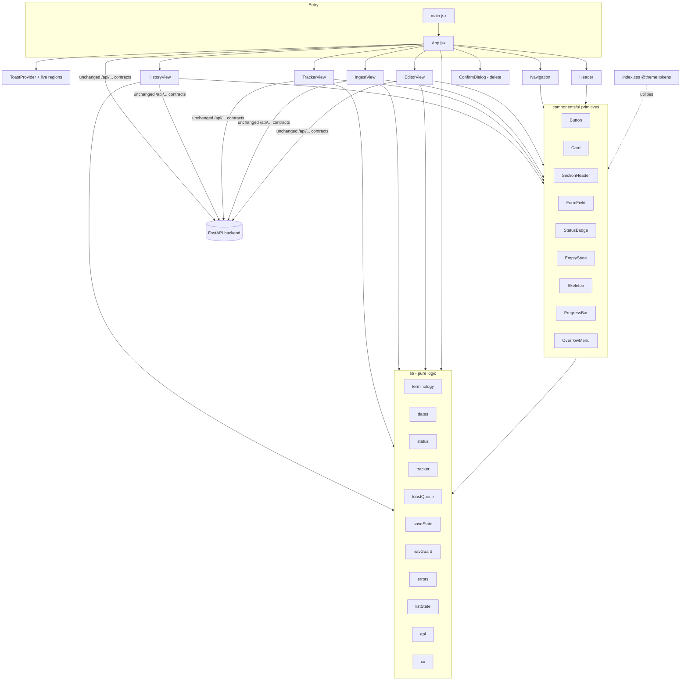
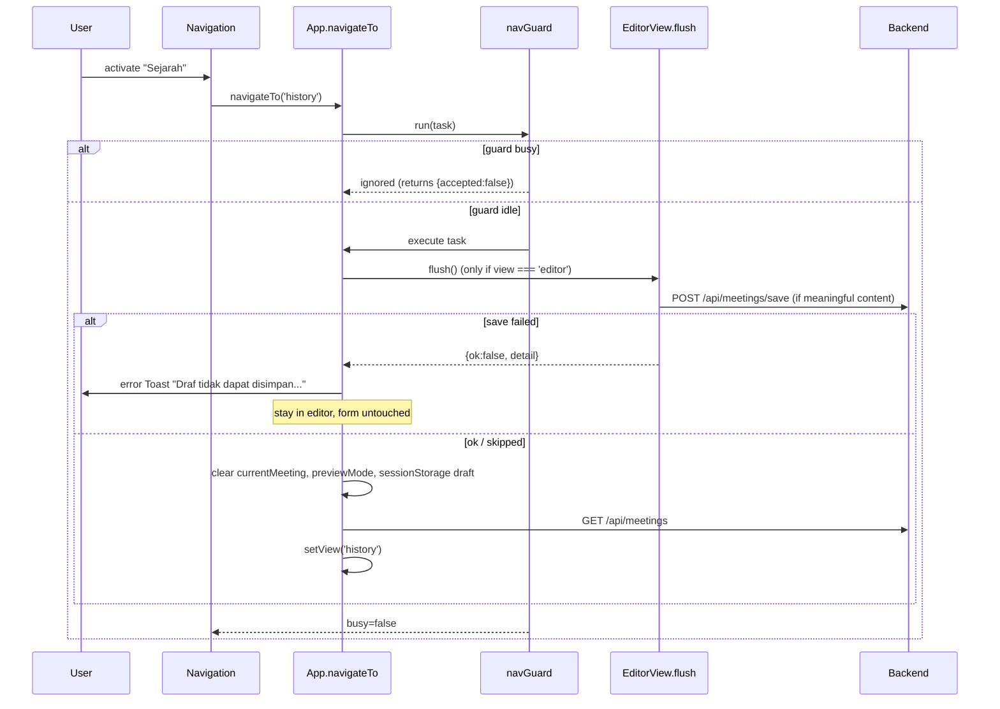
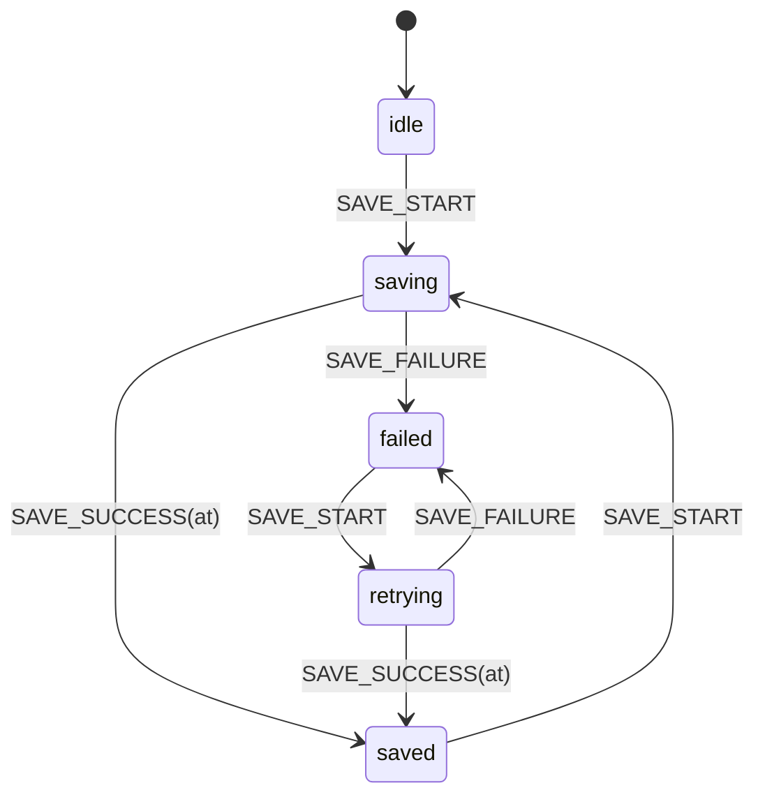

# Design Document: Professional UI Redesign

## Overview

This design turns the current two-identity frontend (purple/fuchsia gradients in Header, Navigation, HistoryView, TrackerView; restrained navy in EditorView, IngestView) into one formal, government-appropriate interface built on a single design system. It is a frontend-only change under `frontend/`. Backend endpoints, request payloads, response handling, the 3-second auto-save debounce, the stable meeting `id` and the export output stay as they are today.

The work splits into four layers:

1. **Design tokens** in one Tailwind v4 `@theme` block in `frontend/src/index.css`. Default Tailwind colour, radius, shadow and font namespaces are reset, so a stray `purple-600` or `rounded-2xl` simply does not compile into a style.
2. **UI primitives** under `frontend/src/components/ui/` (Button, Card, SectionHeader, FormField, StatusBadge, EmptyState, Skeleton, ProgressBar, Toast system, ConfirmDialog, OverflowMenu).
3. **Pure logic modules** under `frontend/src/lib/` (terminology, date formatting, status mapping, tracker classification/statistics/sorting, toast queue reducer, save-indicator reducer, navigation guard, error message composition, list-state selection). These carry the behaviour that the requirements pin down precisely and are the target of property-based tests.
4. **View refactors** of `App.jsx`, `Header`, `Navigation`, `HistoryView`, `TrackerView`, `IngestView`, `EditorView` to use layers 1–3.

### Current-state findings that shape the design

| Area | Current state (read from source) | Design response |
|---|---|---|
| Colours | Raw `#1b3a5b`, `purple-*`, `indigo-*`, `fuchsia-*`, gradients, blurred orbs, `animate-pulse` | Token-only palette; `--color-*: initial` reset in `@theme` |
| Dynamic classes | `` `border-${item.color}-200` ``, `textColor.replace('text-','bg-')` in TrackerView | Static variant maps + `cx()` joiner of complete class strings |
| Icons | Emoji (📚 📊 🤖 ✨ 📋 ✏️ ⏳ ⚡ 🚨), hand-written `<svg><path>` everywhere; `lucide-react` installed, unused | All icons via `lucide-react` |
| Feedback | `alert()` / `window.confirm()` in App, IngestView, EditorView; silent catch in `useAutoSave.save` and Tracker status save | Toast system + ConfirmDialog; save returns a result object |
| English strings | "Overview", "No date", "No location", "Edit" in HistoryView | Terminology module |
| Dates | `new Date('YYYY-MM-DD')` (UTC parse) + `toLocaleDateString('ms-MY', {month:'short'})` in Tracker, `month:'long'` in Editor, raw string in History | One `formatDisplayDate()` with a deterministic month table and local calendar parsing |
| Navigation | `navigateTo` awaits `editorRef.current.flush()` but ignores the result; no re-entrancy guard | Navigation guard; flush returns `{ ok }`; failed flush keeps the editor open |
| Tracker status save | Optimistic update; failure only logged; persists from a possibly stale `localMeetings` closure | Optimistic update with rollback via pure `applyActionStatus()`; error toast |
| `App.css` | Present, not imported anywhere | Delete file |
| `index.html` | `lang="en"` | `lang="ms"`, title "Penjana Minit Mesyuarat" |
| Header subtitle | "Sistem Automasi Minit Mesyuarat Bertenaga AI · Sektor Awam Malaysia" | "Sektor Awam Malaysia" (Req 2.3) |
| Status in editor | `initForm()` drops `status`; auto-save always sends `Draf` unless form status is `Selesai` | Unchanged (Req 13.1). AI_Draft_Notice reads the incoming `meeting.status` prop, not form state |

### Research notes

- **Tailwind v4 theme namespaces.** Tokens declared in `@theme` generate utilities by namespace (`--color-*` → `bg-*`/`text-*`/`border-*`, `--radius-*` → `rounded-*`, `--shadow-*` → `shadow-*`, `--font-*` → `font-*`, `--text-*` → `text-*`, `--aspect-*` → `aspect-*`, `--ease-*` → `ease-*`). Setting a namespace to `initial` (for example `--color-*: initial;`) removes the defaults, so only our palette exists. Tailwind detects classes by scanning source for complete tokens, which is why interpolated names like `` `text-${c}-900` `` are dropped from the build ([Tailwind docs: Theme variables](https://tailwindcss.com/docs/theme), [Detecting classes in source files](https://tailwindcss.com/docs/detecting-classes-in-source-files)).
- **WCAG 2.1 AA.** 4.5:1 for normal text, 3:1 for large text and non-text UI components (1.4.3, 1.4.11); 2.4.7 focus visible; 1.4.10 reflow at 320 CSS px (our 200% zoom at 1280px gives 640px, within the mobile/tablet layouts). Contrast values below were computed with the WCAG relative-luminance formula and are re-verified by an automated test that parses the `@theme` block.
- **Live regions.** Live regions announce reliably only if the container exists in the DOM before content is inserted, so the toast provider mounts its `role="status"` and `role="alert"` containers once at app start and inserts messages into them.
- **Modal focus.** The WAI-ARIA APG dialog pattern: `role="dialog"`, `aria-modal="true"`, `aria-labelledby`, initial focus on the first focusable element, Tab/Shift+Tab cycling, Escape closes, focus returns to the opener. A custom implementation is used rather than native `<dialog>` because jsdom support for `showModal()` is incomplete and native `<dialog>` lets Tab escape to browser chrome.
- **Test tooling versions** (checked with `npm view` on the registry): `vitest` 5.0.3 (peer `vite ^6.4 || ^7 || ^8`, compatible with Vite 8), `jsdom` 30.1.2, `@testing-library/react` 16.3.3 (supports React 19), `@testing-library/user-event` 14.6.7, `@testing-library/jest-dom` 7.0.1, `fast-check` 4.10.2.

## Architecture



### File layout

```text
frontend/
├── index.html                      # lang="ms", Bahasa Melayu <title>
├── vite.config.js                  # + `test` block (Vitest)
├── package.json                    # + test devDependencies (pinned), "test" script
└── src/
    ├── index.css                   # the ONLY @theme block; base, focus, reduced-motion rules
    ├── main.jsx
    ├── App.jsx                     # view state, navigation guard, delete dialog, ToastProvider
    ├── lib/
    │   ├── cx.js                   # joins complete class strings, drops falsy
    │   ├── terminology.js          # all recurring BM terms + view titles/descriptions
    │   ├── dates.js                # parseCalendarDate, formatDisplayDate, compareCalendarDates, todayLocal
    │   ├── status.js               # STATUS_CONFIG, getStatusConfig
    │   ├── tracker.js              # flattenActionItems, classifyActionItem, computeTrackerStats,
    │   │                           #   computeHistoryStats, completionRate, sortActionRows, applyActionStatus
    │   ├── toastQueue.js           # pure reducer for the toast stack
    │   ├── saveState.js            # pure reducer + label for Save_Indicator, formatSavedTime
    │   ├── navGuard.js             # createNavigationGuard()
    │   ├── errors.js               # buildErrorMessage()
    │   ├── listState.js            # selectListState()
    │   ├── progress.js             # clampPercent, formatAudioTime, formatAudioProgress
    │   ├── draftNotice.js          # shouldShowAiDraftNotice()
    │   └── api.js                  # requestJson(): fetch wrapper returning { ok, data, detail }
    ├── components/
    │   ├── ui/
    │   │   ├── Button.jsx  Card.jsx  SectionHeader.jsx  FormField.jsx
    │   │   ├── StatusBadge.jsx  EmptyState.jsx  Skeleton.jsx  ProgressBar.jsx
    │   │   ├── OverflowMenu.jsx  ConfirmDialog.jsx
    │   │   ├── ToastProvider.jsx   # provider + live regions + Toast rendering
    │   │   └── toastContext.js     # context + useToast hook (separate file for react-refresh lint)
    │   ├── Header.jsx  Navigation.jsx  PageHeader.jsx
    │   ├── HistoryView.jsx  TrackerView.jsx  IngestView.jsx  EditorView.jsx
    │   └── editor/                 # SaveIndicator.jsx, SectionNav.jsx, DocumentPreview.jsx, editorSections.js
    └── test/
        ├── setup.js                # jest-dom matchers, cleanup
        └── ...                     # *.test.js / *.test.jsx (see Testing Strategy)
```

`frontend/src/App.css` is deleted (Req 1.7). It is not imported anywhere today, so removal has no runtime effect.

### Navigation flow with guard and flush



`Navigation` receives `navBusy` and sets `aria-disabled` / ignores activations while true (Req 4.10). The guard is the source of truth; the visual state is a hint.

### Save indicator state machine



| State | Label | Tone / icon |
|---|---|---|
| `idle` | "Auto-simpan aktif" | neutral, `Cloud` |
| `saving` | "Menyimpan..." | neutral, `Loader2` (spins; static under reduced motion) |
| `saved` | "Disimpan pada HH:MM" | success, `CloudCheck`/`Check` |
| `failed` | "Gagal disimpan" | danger, `CloudAlert`/`AlertCircle` |
| `retrying` | "Gagal disimpan · Menyimpan..." | danger, `Loader2` |

Req 9.1 ("Menyimpan..." while a request runs) and Req 9.3 ("Gagal disimpan" until the next success) overlap when a retry starts after a failure. The `retrying` state shows both strings so neither criterion is violated.

## Components and Interfaces

### Design tokens (`src/index.css`)

Single `@theme` block. Namespaces reset first so only these tokens exist.

```css
@import "tailwindcss";

@theme {
  --color-*: initial;
  --radius-*: initial;
  --shadow-*: initial;
  --font-*: initial;
  --text-*: initial;

  /* Neutral (slate) */
  --color-white: #ffffff;
  --color-neutral-50:  #f8fafc;  /* page background */
  --color-neutral-100: #f1f5f9;  /* subtle fill, neutral badge bg */
  --color-neutral-200: #e2e8f0;  /* card / divider border (decorative) */
  --color-neutral-300: #cbd5e1;  /* skeleton fill */
  --color-neutral-500: #64748b;  /* input + badge borders (4.76:1 on white) */
  --color-neutral-600: #475569;  /* secondary text (7.58:1 on white) */
  --color-neutral-700: #334155;  /* strong secondary text, neutral badge fg */
  --color-neutral-900: #0f172a;  /* body text */

  /* Primary navy */
  --color-primary:        #1b3a5b;
  --color-primary-hover:  #142c45;
  --color-primary-active: #0e1f31;
  --color-primary-subtle: #eef3f8;  /* hover fill on light surfaces */
  --color-on-primary:     #ffffff;
  --color-on-primary-muted: #d9e3ee; /* header subtitle on navy */

  /* Gold accent: rules, borders, icons only */
  --color-accent:       #9a7b2f;   /* on light surfaces (≈4.0:1, icon/border use) */
  --color-accent-light: #d4b45c;   /* thin rule on navy (≈5.8:1) */

  /* Semantic: fg / bg / border triplets + solid */
  --color-success-fg: #166534; --color-success-bg: #dcfce7; --color-success-border: #15803d; --color-success: #15803d;
  --color-warning-fg: #92400e; --color-warning-bg: #fef3c7; --color-warning-border: #b45309; --color-warning: #b45309;
  --color-danger-fg:  #991b1b; --color-danger-bg:  #fee2e2; --color-danger-border:  #b91c1c; --color-danger:  #b91c1c;
  --color-danger-hover: #991b1b;
  --color-info-fg:    #1e40af; --color-info-bg:    #dbeafe; --color-info-border:    #1d4ed8; --color-info:    #1d4ed8;
  --color-neutral-fg: #334155; --color-neutral-bg: #f1f5f9; --color-neutral-border: #64748b;

  /* Focus */
  --color-focus: #1b3a5b;

  /* Official document surface (preview only; not used by app chrome) */
  --color-doc-paper: #ffffff;
  --color-doc-ink:   #000000;
  --color-doc-muted: #404040;
  --color-doc-rule:  #000000;

  /* Typography: system fonts only, no network requests */
  --font-sans: "Segoe UI", system-ui, -apple-system, Roboto, "Helvetica Neue", Arial, sans-serif;
  --font-mono: ui-monospace, "Cascadia Mono", Consolas, "Liberation Mono", "Courier New", monospace;

  /* Type scale: 6 sizes, 12px..30px */
  --text-xs:   0.75rem;  --text-xs--line-height:   1.5;   /* 12px labels, helper, table headers */
  --text-sm:   0.875rem; --text-sm--line-height:   1.6;   /* 14px body */
  --text-base: 1rem;     --text-base--line-height: 1.5;   /* 16px h3 */
  --text-lg:   1.25rem;  --text-lg--line-height:   1.4;   /* 20px h2 */
  --text-xl:   1.5rem;   --text-xl--line-height:   1.3;   /* 24px h1 */
  --text-2xl:  1.875rem; --text-2xl--line-height:  1.2;   /* 30px statistic numbers */

  /* Radius: max 8px */
  --radius-sm: 4px; --radius-md: 6px; --radius-lg: 8px; --radius-full: 9999px; /* full: badges/progress only */

  /* Shadows */
  --shadow-sm: 0 1px 2px 0 rgb(15 23 42 / 0.06);
  --shadow-md: 0 4px 12px -2px rgb(15 23 42 / 0.12);   /* toast, dialog, overflow menu */

  /* Motion */
  --ease-standard: cubic-bezier(0.2, 0, 0, 1);
  --duration-fast: 150ms;

  /* Layout */
  --container-content: 80rem;   /* 1280px main content max width */
  --aspect-a4: 1 / 1.414;
}
```

Notes:

- `--radius-full` applies only to Status_Badge pills and progress tracks, which are not in the Req 2.7 element list (card, button, input, select, textarea). Those elements use `rounded-sm|md|lg`.
- Heading sizes satisfy Req 3.6: h1 24px ≥ h2 20px > h3 16px > body 14px. On mobile h1 stays 24px; nothing exceeds 32px (Req 3.3).
- Font weights used: `font-normal`, `font-medium`, `font-semibold`, `font-bold` only (Req 3.8). `font-black` is removed.
- Shadows use `rgb()` inside the `@theme` block. Req 1.2 restricts raw colour values in components, not token definitions.
- `@theme` is the only token definition site (Req 1.1). A test fails if any other file contains `@theme`.

Non-token global CSS in `index.css` (outside `@theme`):

```css
@layer base {
  html { background: var(--color-neutral-50); color: var(--color-neutral-900); scroll-padding-top: 5rem; }
  body { font-family: var(--font-sans); font-size: var(--text-sm); line-height: 1.6; }
  :focus-visible { outline: 2px solid var(--color-focus); outline-offset: 2px; }
}
@media (prefers-reduced-motion: reduce) {
  *, *::before, *::after {
    animation-duration: 0ms !important; animation-iteration-count: 1 !important;
    transition-duration: 0ms !important; scroll-behavior: auto !important;
  }
}
```

`scroll-padding-top` matches the sticky editor action bar height so a focused field is never hidden under it (Req 9.6). The single `:focus-visible` rule gives every Interactive_Element the same indicator (Req 1.9, 10.2): 2px navy outline offset onto the light surface (≈11.6:1 against white, ≈11.1:1 against neutral-50). The `fadeIn` keyframes and custom scrollbar colours are removed.

#### Contrast pairs (verified by test)

| Foreground | Background | Use | Ratio (≈) | Required |
|---|---|---|---|---|
| on-primary `#fff` | primary `#1b3a5b` | header title, primary button, active nav | 11.6 | 4.5 |
| on-primary-muted `#d9e3ee` | primary | header subtitle | 9.0 | 4.5 |
| accent-light `#d4b45c` | primary | header bottom rule | 5.8 | 3 |
| neutral-900 | white / neutral-50 | body text | 17.9 / 17.1 | 4.5 |
| neutral-600 | white / neutral-50 | secondary text | 7.6 / 7.2 | 4.5 |
| neutral-500 | white | input, badge borders | 4.8 | 3 |
| accent `#9a7b2f` | white | gold icons, card top rule | 4.0 | 3 |
| success-fg | success-bg | Selesai badge | 6.5 | 4.5 |
| warning-fg | warning-bg | Draf badge | 6.4 | 4.5 |
| danger-fg | danger-bg | Tertunggak badge, error toast | 6.8 | 4.5 |
| info-fg | info-bg | Sedang Berjalan badge, info toast | 7.2 | 4.5 |
| neutral-fg | neutral-bg | Belum Mula / Tidak Diketahui | 9.5 | 4.5 |
| white | danger `#b91c1c` | danger button | 6.5 | 4.5 |
| `*-border` | `*-bg` | badge borders | ≥ 3.0 | 3 |
| focus | white / neutral-50 | focus outline | 11.6 / 11.1 | 3 |

### `lib/cx.js`

```js
/** Joins complete, statically written class strings. Falsy entries are dropped. */
export function cx(...parts) { return parts.filter(Boolean).join(' '); }
```

All variant styling lives in object maps whose values are complete literal class strings, so Tailwind's scanner sees every class (Req 1.6).

### UI primitives

| Primitive | Props | Behaviour |
|---|---|---|
| `Button` | `variant: 'primary'\|'secondary'\|'outline'\|'ghost'\|'danger'`, `size: 'sm'\|'md'`, `icon` (lucide component), `iconOnly`, `busy`, `disabled`, `as` (`'button'`\|`'a'`), `type='button'`, `aria-label`, rest | Renders `<button>` (or `<a>` for downloads). `disabled \|\| busy` → native `disabled` on buttons; on `<a>` → `aria-disabled="true"`, `tabIndex=-1`, click prevented. `busy` → `aria-busy="true"`, spinner (`Loader2`, `aria-hidden`) replaces icon, click handler not called. `aria-busy` is always rendered as `"true"`/`"false"` for buttons that accept `busy` (Req 8.6). `iconOnly` requires `aria-label` (dev-time `console.error` if missing). Min height 40px (`h-10`) at all sizes for Req 10.11. |
| `Card` | `as`, `padding: 'md'\|'lg'`, `accent` (bool: 2px gold top rule), `children` | `bg-white border border-neutral-200 rounded-lg shadow-sm`. |
| `SectionHeader` | `title`, `level` (default 3), `description`, `actions`, `id` | Heading `text-base font-semibold text-primary` + 1px `border-b border-neutral-200`; optional right-aligned actions. Accepts `tabIndex={-1}` and `ref` for SectionNav focus (Req 9.10). |
| `FormField` | `label`, `id` (optional, else `useId()`), `required`, `helper`, `error`, `children` (render-prop `({id, describedBy, invalid}) => control`) or `as: 'input'\|'select'\|'textarea'` + control props | Visible `<label htmlFor>`; helper and error get ids joined into `aria-describedby`; `error` → `aria-invalid="true"`, danger border, error text with `AlertCircle` icon. Value is controlled by the caller, so it is never cleared on error (Req 10.4, 10.14). Control classes: `border border-neutral-500 rounded-md bg-white text-sm px-3 py-2 min-h-10`; hover `border-neutral-700`; focus uses the global outline. |
| `StatusBadge` | `status` (raw string), `size='md'` | Looks up `getStatusConfig(status)`; renders pill with icon (`aria-hidden`) + text label. Accessible name is the label text. |
| `EmptyState` | `icon`, `title`, `description`, `action?: {label, onClick, icon}` | Centered block; title `h3`; action rendered as primary Button. |
| `Skeleton` | `variant: 'card'\|'row'`, `count` (clamped 3..6) | `aria-hidden` neutral blocks inside a container with `role="status"` and visually hidden "Memuatkan..." text. No pulse (decorative looping animation is banned by Req 2.4). |
| `ProgressBar` | `value` (0..100), `label`, `tone` | `role="progressbar"`, `aria-valuemin=0`, `aria-valuemax=100`, `aria-valuenow={clampPercent(value)}`, `aria-label`. Fill width via inline `style={{ width: \`${pct}%\` }}` (width only, no colour). |
| `OverflowMenu` | `label` (aria-label), `items: [{label, icon, onSelect, href, download, tone}]` | Disclosure button (`MoreHorizontal`, `aria-expanded`, `aria-controls`) + list of buttons/links. Escape and outside click close and return focus to the trigger. |
| `ConfirmDialog` | `open`, `title`, `message`, `confirmLabel`, `cancelLabel`, `tone='danger'`, `onConfirm`, `onCancel`, `returnFocusRef`, `busy` | Portal into `document.body`; backdrop; `role="dialog"`, `aria-modal="true"`, `aria-labelledby`, `aria-describedby`. On open: sets `inert` on `#root`, focuses the first focusable element (Batal is first in DOM). Keydown: Tab/Shift+Tab cycle within focusables; Escape → `onCancel`. Backdrop `mousedown` outside the panel → `onCancel`. On close: removes `inert`, focuses `returnFocusRef.current`. |
| `ToastProvider` / `useToast` | `useToast()` → `{ success(msg, opts), info(msg, opts), error(msg, opts), dismiss(id) }`; `opts: {title, action: {label, onAction}}` | Holds `toastQueue` reducer state. Always renders two live containers: `<div role="status" aria-live="polite">` and `<div role="alert" aria-live="assertive">`, positioned fixed top-right (bottom on mobile). Each toast: icon, title (from terminology), message, optional action Button, close icon Button `aria-label="Tutup pemberitahuan"`. Success/info schedule auto-dismiss at 5500ms; error toasts have no timer (Req 7.3, 7.4). Timers are cleared on manual dismiss/unmount. |

Button variant map (complete strings):

```js
const VARIANT = {
  primary:   'bg-primary text-on-primary border border-primary hover:bg-primary-hover active:bg-primary-active',
  secondary: 'bg-neutral-100 text-neutral-900 border border-neutral-200 hover:bg-neutral-200 active:bg-neutral-300',
  outline:   'bg-white text-primary border border-primary hover:bg-primary-subtle active:bg-neutral-200',
  ghost:     'bg-white text-primary border border-white hover:bg-primary-subtle active:bg-neutral-200',
  danger:    'bg-danger text-white border border-danger hover:bg-danger-hover active:bg-danger-fg',
};
const DISABLED = 'disabled:bg-neutral-100 disabled:text-neutral-600 disabled:border-neutral-200 disabled:cursor-not-allowed';
const BASE = 'inline-flex items-center justify-center gap-2 rounded-md font-medium text-sm min-h-10 px-4 transition-colors duration-150 ease-standard';
```

Hover and focus only change colour, border or shadow; no `scale-*`, `translate-*` or size changes (Req 2.4, 2.5). `duration-150` is within the 200ms limit.

### Terminology module (`lib/terminology.js`)

One frozen object. Views import from it; they never inline recurring terms.

```js
export const T = Object.freeze({
  app: { name: 'Penjana Minit Mesyuarat', subtitle: 'Sektor Awam Malaysia', tabTitle: 'Penjana Minit Mesyuarat' },
  nav: { history: 'Sejarah', tracker: 'Penjejak', ingest: 'Ekstrak AI', newMeeting: 'Minit Baharu', label: 'Navigasi utama' },
  actions: {
    view: 'Lihat', edit: 'Sunting', delete: 'Padam', download: 'Muat Turun', preview: 'Pratonton',
    save: 'Simpan', cancel: 'Batal', close: 'Tutup', retry: 'Cuba Lagi', add: 'Tambah', remove: 'Buang',
    clear: 'Kosongkan', upload: 'Muat Naik', replace: 'Ganti', backToForm: 'Kembali ke Borang',
    generate: 'Jana Minit Mesyuarat', extract: 'Ekstrak dengan AI', clearSearch: 'Kosongkan Carian',
    more: 'Tindakan lain',
  },
  status: { draft: 'Draf', done: 'Selesai', notStarted: 'Belum Mula', inProgress: 'Sedang Berjalan',
            overdue: 'Tertunggak', unknown: 'Tidak Diketahui' },
  headings: { error: 'Ralat', success: 'Berjaya', info: 'Makluman' },
  messages: {
    genericError: 'Operasi gagal. Sila cuba lagi.',
    noDate: 'Tiada tarikh', noLocation: 'Tiada tempat', unassigned: 'Belum Ditetapkan',
    loading: 'Memuatkan...', saving: 'Menyimpan...', saveFailed: 'Gagal disimpan',
    savedAt: (hhmm) => `Disimpan pada ${hhmm}`, autosaveIdle: 'Auto-simpan aktif',
    extracting: 'Mengekstrak minit...',
    aiDraftNotice: 'Kandungan ini ialah draf yang dijana oleh AI. Sila semak dan sahkan sebelum dijadikan rekod rasmi.',
    modelDownloading: 'Model Whisper sedang dimuat turun buat kali pertama. Transkripsi seterusnya tidak perlu melalui langkah ini.',
  },
  ops: {  // operation names used in success/error toasts
    save: 'Menyimpan minit', generate: 'Menjana minit mesyuarat', delete: 'Memadam minit',
    loadFile: 'Memuatkan fail', transcribe: 'Transkripsi audio', extract: 'Pengekstrakan AI',
    loadMeeting: 'Memuatkan rekod minit', loadMeetings: 'Memuatkan senarai mesyuarat',
    autosave: 'Auto-simpan draf', statusSave: 'Mengemas kini status tindakan', templateRead: 'Membaca fail templat',
    navigateFlush: 'Draf tidak dapat disimpan. Anda kekal di halaman penyuntingan.',
  },
  success: {
    save: 'Minit berjaya disimpan.', generate: 'Minit mesyuarat berjaya dijana dan disimpan.',
    delete: 'Minit mesyuarat berjaya dipadam.', loadFile: (name) => `Fail berjaya dimuatkan: ${name}`,
    transcribe: 'Transkripsi audio selesai.',
  },
  views: {
    history: { title: 'Sejarah Minit Mesyuarat', description: 'Semak, sunting dan muat turun minit mesyuarat yang telah disimpan.' },
    tracker: { title: 'Penjejak Tindakan Susulan', description: 'Pantau status dan tarikh akhir tindakan susulan daripada semua mesyuarat.' },
    ingest:  { title: 'Ekstrak Minit dengan AI', description: 'Muat naik audio atau teks transkrip, kemudian ekstrak draf minit untuk disemak.' },
    editor:  { title: 'Penyuntingan Minit Mesyuarat', description: 'Lengkapkan dan sahkan kandungan minit mengikut format PKPA Bil. 2/1991.' },
  },
  months: ['Januari','Februari','Mac','April','Mei','Jun','Julai','Ogos','September','Oktober','November','Disember'],
});
```

All view descriptions are under 120 characters (asserted by test, Req 3.4).

### Date helpers (`lib/dates.js`)

```js
/** @returns {{year:number, month:number, day:number} | null} */
export function parseCalendarDate(value)
export function formatDisplayDate(value)          // "05 Mac 2026" | "Tiada tarikh"
export function compareCalendarDates(a, b)        // -1 | 0 | 1
export function todayLocal(now = new Date())      // {year, month, day} from local clock
```

Parsing rules (deterministic, timezone-independent):

1. Non-string or blank → `null`.
2. `^(\d{4})-(\d{2})-(\d{2})(?:[T ].*)?$` → year/month/day from the captured digits (the time part is ignored, so `2026-03-05T23:00Z` stays the 5th).
3. `^(\d{1,2})/(\d{1,2})/(\d{4})$` → day/month/year (Malaysian order), for legacy hand-entered values.
4. Range check: month 1–12, day 1–`daysInMonth(year, month)` (leap years via Gregorian rule), year 1000–9999. Out of range → `null`.
5. Anything else → `null`.

`formatDisplayDate` = `${pad2(day)} ${T.months[month-1]} ${year}`, or `T.messages.noDate` when `parseCalendarDate` returns `null`. It does not use `Intl`, so output is identical across browsers and Node/jsdom ICU builds. The stored value is never modified (Req 5.5).

### Status configuration (`lib/status.js`)

```js
export const STATUS_KEYS = ['Draf', 'Selesai', 'Belum Mula', 'Sedang Berjalan', 'Tertunggak'];
export const STATUS_CONFIG = {
  'Draf':            { label: 'Draf',            tone: 'warning', Icon: PencilLine },
  'Selesai':         { label: 'Selesai',         tone: 'success', Icon: CircleCheck },
  'Belum Mula':      { label: 'Belum Mula',      tone: 'neutral', Icon: Circle },
  'Sedang Berjalan': { label: 'Sedang Berjalan', tone: 'info',    Icon: Clock },
  'Tertunggak':      { label: 'Tertunggak',      tone: 'danger',  Icon: TriangleAlert },
};
export const UNKNOWN_STATUS = { label: 'Tidak Diketahui', tone: 'neutral', Icon: CircleHelp };
export function getStatusConfig(raw)  // exact match on raw string, else UNKNOWN_STATUS
export const TONE_CLASSES = {
  success: 'bg-success-bg text-success-fg border border-success-border',
  warning: 'bg-warning-bg text-warning-fg border border-warning-border',
  danger:  'bg-danger-bg text-danger-fg border border-danger-border',
  info:    'bg-info-bg text-info-fg border border-info-border',
  neutral: 'bg-neutral-bg text-neutral-fg border border-neutral-border',
};
```

`Selesai` is shared by meeting and action-item status, as Req 6.1 specifies. The `status.js` module imports lucide icons; the pure mapping is tested on `label`, `tone` and `Icon` identity.

### Tracker logic (`lib/tracker.js`)

```js
/** Flattens meetings → rows in source order (meeting order, then item order). */
export function flattenActionItems(meetings)
  // → [{ key, meetingId, meetingTitle, actionIndex, sourceOrder, task, assignee, deadline, storedStatus }]

/** Display status for one row. */
export function classifyActionItem({ storedStatus, deadline }, today)
  // 'Tertunggak' if storedStatus !== 'Selesai' && parseCalendarDate(deadline) && date < today
  // else storedStatus (raw; StatusBadge maps unknown values to "Tidak Diketahui")

/** Bucket used for statistics cards. */
export function statBucket(displayStatus)
  // 'Tertunggak' | 'Selesai' | 'Sedang Berjalan' | 'Belum Mula'  (anything else → 'Belum Mula')

export function computeTrackerStats(rows, today)
  // → { total, 'Belum Mula', 'Sedang Berjalan', 'Tertunggak', 'Selesai' }

export function computeHistoryStats(meetings)
  // → { total, draft: count(status === 'Draf'), done: count(status === 'Selesai') }

export function completionRate(done, total)       // total === 0 ? 0 : Math.round(done / total * 100)

export function sortActionRows(rows, today)
  // stable: overdue group first; then deadline asc; rows without a parseable deadline last;
  // ties keep sourceOrder

export function applyActionStatus(meetings, meetingId, actionIndex, newStatus)
  // pure: returns { meetings: next, previousStatus, updatedMeeting }

export function filterActionRows(rows, { term, status }, today)
  // same matching as today's TrackerView: task/assignee/meetingTitle substring, status filter semantics
```

Design decision (gap in requirements): an action item whose stored status is empty or unknown shows the "Tidak Diketahui" badge (Req 6.7), but is counted in the **Belum Mula** statistic card. This keeps the partition invariant in Req 12.2 (four cards sum to Jumlah) and matches the current behaviour where `item.status || 'Belum Mula'` is used. An empty stored status in the Tracker status `<select>` also shows "Belum Mula" as today. If this needs a separate "Tidak Diketahui" count, Requirement 12.2 should be revised.

History stats keep today's semantics: Draf and Selesai count exact matches only, so a meeting with an unknown status counts in Jumlah but in neither Draf nor Selesai (Req 12.1 defines the counts that way).

### Toast queue (`lib/toastQueue.js`)

```js
export const MAX_VISIBLE = 3;
export const AUTO_DISMISS_MS = 5500;
export const initialToastState = { visible: [], pending: [] };
export function toastReducer(state, action)
  // action: { type: 'add', toast } | { type: 'dismiss', id }
export function autoDismissDelay(type)   // 'success'|'info' → 5500; 'error' → null
```

`add`:
1. If `visible.length < 3` → append to `visible`.
2. Else if some visible toast is `success`/`info` → remove the oldest such toast, append the new one.
3. Else (three errors visible) → append the new toast to `pending`. Error toasts are never removed except by the user (Req 7.4).

`dismiss`: remove by id from `visible` or `pending`; then promote from `pending` (FIFO) while `visible.length < 3`.

Visible order is always order of appearance (Req 7.11).

### Save state (`lib/saveState.js`)

```js
export const initialSaveState = { phase: 'idle', savedAt: null };
export function saveReducer(state, event)  // events: SAVE_START | SAVE_SUCCESS {at: Date} | SAVE_FAILURE
export function formatSavedTime(date)      // "HH:MM", 24h, zero-padded, local time
export function saveLabel(state)           // label per table in Architecture
export function saveTone(state)            // 'neutral' | 'success' | 'danger'
```

### Navigation guard (`lib/navGuard.js`)

```js
export function createNavigationGuard(onBusyChange) {
  let busy = false;
  return {
    isBusy: () => busy,
    async run(task) {
      if (busy) return { accepted: false };
      busy = true; onBusyChange?.(true);
      try { return { accepted: true, result: await task() }; }
      finally { busy = false; onBusyChange?.(false); }
    },
  };
}
```

`App` creates one guard in a `useRef`. `navigateTo`, `handleNewMeeting`, `handleSelectMeeting`, `handleEditMeeting` and `handleEditorBack` all run through it, so at most one navigation change is in flight (Req 4.10).

### Error composition (`lib/errors.js`) and API wrapper (`lib/api.js`)

```js
export function buildErrorMessage(operation, detail)
  // detail is a non-empty string after trim → `${operation} gagal: ${detail}` (detail inserted verbatim)
  // otherwise → `${operation} gagal. ${T.messages.genericError}`
```

```js
export async function requestJson(url, options)
  // → { ok: true, status, data } | { ok: false, status, detail }
  // network error → { ok:false, status:0, detail: '' }
  // non-2xx → tries res.json().detail (string; arrays from FastAPI validation are joined by '; '), else ''
```

`requestJson` passes `url` and `options` to `fetch` unchanged, so method, headers and body stay identical (Req 13.1). Streaming transcription (`/api/transcribe`) keeps its own `fetch` + reader loop; only its error handling changes.

### Other pure helpers

- `lib/listState.js` — `selectListState({ loading, totalCount, visibleCount })` → `'loading' | 'empty' | 'no-match' | 'list'`. `loading` wins; `totalCount === 0` → `'empty'`; `visibleCount === 0` → `'no-match'`; else `'list'` (Req 8.1, 8.7, 8.8).
- `lib/progress.js` — `clampPercent(x)` → integer 0..100 (`NaN` → 0); `formatAudioTime(sec)` → `M:SS` or `H:MM:SS`; `formatAudioProgress(elapsed, total)` → `"elapsed / total"` when `total` is a finite number > 0, else `"elapsed"` (Req 8.2, 8.3).
- `lib/draftNotice.js` — `shouldShowAiDraftNotice(status, rawTranscript)` → `status === 'Draf' && /\S/.test(rawTranscript ?? '')` (Req 9.7, 9.8).
- Existing `hasMeaningfulContent`, `initForm`, `serializeParticipants` move from `EditorView.jsx` to `components/editor/editorForm.js` unchanged, so they can be tested directly. Logic is not modified.

### View-level design

#### App shell (`App.jsx`)

- Wraps everything in `ToastProvider`. Background: `bg-neutral-50` on the page root; no gradient (Req 2.2).
- State added: `meetingsLoading` (bool), `navBusy` (bool), `pendingDelete` (`{ id, title } | null`), `deleteBusy`.
- `deleteTriggerRef` stores the button that opened the dialog for focus return.
- Main container: `mx-auto w-full max-w-(--container-content) px-4 md:px-6 pb-16` (Req 11.6).
- `fetchMeetings()` uses `requestJson('/api/meetings')`; failure → error toast with `buildErrorMessage(T.ops.loadMeetings, detail)`.
- `navigateTo(newView)`: guard → if leaving editor, `const r = await editorRef.current?.flush()`; `if (r && r.ok === false)` → error toast `T.ops.navigateFlush` + detail and return without changing view (Req 4.11). Otherwise existing steps unchanged (Req 4.8, 13.5).
- `handleDeleteMeeting(id)` now opens the dialog: `setPendingDelete({ id, title })`. On confirm: `DELETE /api/meetings/{id}` → success toast + remove from list; failure → error toast; dialog closes and focus returns to the opener (if the meeting was removed, focus goes to the History view heading instead, since the opener no longer exists).
- `handleSelectMeeting` / `handleEditMeeting`: on non-ok or network error → error toast (previously non-ok was silently ignored).
- Each view is preceded by `PageHeader` (`h2` title + description from `T.views`), rendered directly below Navigation (Req 3.4).

#### Header

Solid `bg-primary`, `border-b-2 border-accent-light` (thin gold rule). `FileText` lucide icon (`aria-hidden`, `text-on-primary`), `h1` "Penjana Minit Mesyuarat" (`text-xl font-bold text-on-primary`), subtitle "Sektor Awam Malaysia" (`text-sm text-on-primary-muted`). No orbs, blur, pulse or gradient (Req 2.3, 2.4).

#### Navigation

`<nav aria-label="Navigasi utama">` in a white bar with `border-b border-neutral-200`. Inside the content container: `<ul>` with four items in order. Item height 48px (`min-h-12`), bar height ≤ 64px (Req 4.2).

- Icons: Sejarah `History`, Penjejak `ListChecks`, Ekstrak AI `FileAudio`, Minit Baharu `FilePlus`. A sparkle/"magic" icon is avoided for the AI item to keep the tone formal.
- Inactive item: `text-neutral-700 hover:bg-primary-subtle border-b-2 border-white`. Active: `text-primary font-semibold border-b-2 border-primary bg-primary-subtle` plus `aria-current="page"`. Two complete class strings selected by a boolean (Req 4.3).
- Minit Baharu is a `Button variant="primary"`, separated by `ml-auto` and a `border-l border-neutral-200 pl-3`. When `view === 'editor'` it gets `aria-current="page"` and an inset ring (`ring-2 ring-inset ring-accent-light`) to show the active state on a navy fill (Req 4.4, 4.5).
- Mobile (< md): the `<ul>` becomes `overflow-x-auto` with `flex-nowrap`; each item `min-h-11 min-w-11` (≥44px); everything is one tap away; the page body does not scroll horizontally (Req 4.6, 11.7).
- `navBusy` → each item gets `aria-disabled="true"` and its click handler returns early.

#### History_View

- Layout: `grid grid-cols-1 lg:grid-cols-4 gap-6`. Sidebar `lg:col-span-1` (stats + filter) stacks above list below `lg` (Req 11.2, 11.3); both columns start at the same row (`items-start`).
- Stats: three `Card`s labelled Jumlah Mesyuarat / Draf / Selesai with `text-2xl font-bold` numbers and `FileText` / `PencilLine` / `CircleCheck` icons tinted with the same tones as StatusBadge. Sidebar section heading "Ringkasan" (replaces "Overview").
- Filter: `<fieldset>` with `legend` "Tapis Mengikut Status" and three toggle Buttons (`aria-pressed`) for Semua / Draf / Selesai with counts.
- Search: `FormField` with visible label "Cari mesyuarat", `Search` icon, same matching fields as today.
- List state via `selectListState`: `loading` → 4 card skeletons; `empty` → EmptyState "Belum ada minit mesyuarat" with action "Minit Baharu" (and secondary "Ekstrak AI"); `no-match` → EmptyState "Tiada rekod sepadan dengan carian" + "Kosongkan Carian" action resetting term and filter.
- Meeting card (`Card as="article"`): `h3` title, StatusBadge, `Calendar` + `formatDisplayDate(m.date)`, `MapPin` + (`m.location || 'Tiada tempat'`). Actions (desktop/tablet), all `size="sm"`: Lihat (primary), Sunting (outline), Muat Turun DOCX (outline, `as="a"` with `download`), Padam (danger). The Padam button passes its element to `deleteTriggerRef` for focus return. Mobile: Lihat + Sunting in one row, plus `OverflowMenu` (`aria-label="Tindakan lain: {title}"`) containing Muat Turun DOCX and Padam (Req 11.4). Two static blocks with `hidden md:flex` / `flex md:hidden`.

#### Tracker_View

- Data pipeline: `rows = flattenActionItems(localMeetings)` → `display = rows.map(classify)` → `stats = computeTrackerStats` → `visible = sortActionRows(filterActionRows(rows, filters, today), today)`. `today = todayLocal()` computed once per render.
- Five stat cards (`grid-cols-2 md:grid-cols-3 lg:grid-cols-5`): Jumlah (neutral, `ListChecks`), Belum Mula, Sedang Berjalan, Tertunggak, Selesai, each using `STATUS_CONFIG` icon and tone (Req 12.2).
- Completion card: "Kadar Penyelesaian", `{rate}%`, a `ProgressBar tone="success"` (single colour `bg-success`), text "{selesai} daripada {jumlah} tindakan selesai". The SVG ring, gradient card and "Taburan Status" pulse bars are removed (covered by the stat cards).
- Filters: search FormField + status `select` FormField (same options and semantics as today).
- List state via `selectListState`. `empty` → EmptyState "Tiada tindakan susulan" with action "Ekstrak AI"; Jumlah 0 also shows rate 0% and an empty bar (Req 12.5).
- Desktop (`hidden lg:block`): `<table>` with `<caption class="sr-only">`, headers Tindakan, Tanggungjawab, Tarikh Akhir, Mesyuarat, Status. Status cell: StatusBadge + compact status `<select>` (`aria-label="Kemas kini status: {task}"`). Tarikh Akhir: `formatDisplayDate(deadline)`; overdue rows show the date in `text-danger-fg`.
- Mobile/tablet (`lg:hidden`): stacked `Card`s using a `<dl>` with the same five labelled fields (Req 12.7).
- Status change: `const { meetings: next, previousStatus, updatedMeeting } = applyActionStatus(...)`; `setLocalMeetings(next)`; `POST /api/meetings/save` with `updatedMeeting` (same payload shape as today: full meeting with modified `action_items`); failure → `setLocalMeetings(prev => applyActionStatus(prev, id, idx, previousStatus).meetings)` + error toast (Req 7.12). The select for that row is disabled with `aria-busy` while saving.

#### Ingest_View

Three Cards, each with `SectionHeader`:

1. **Templat Format Minit** — template `select` (FormField), status badge rendered as a neutral/info tag (not StatusBadge, since it is not a record status), "Struktur Templat" disclosure Button with `aria-expanded` + `ChevronDown` icon (rotation transition 150ms). Standard skeleton preview uses `font-mono text-xs` tokens; custom-template upload stays as is. Accordion uses conditional rendering instead of the grid-rows animation trick.
2. **Muat Naik Dokumen / Audio Mesyuarat** — Whisper model select (FormField with visible label), dropzone as a real `<button type="button">` wrapper area (keyboard-activatable, `aria-describedby` with accepted formats) with `Upload` icon; drag state changes border/background colour only (no scale). Model-download notice: info-tone Card-alert with `Info` icon and `T.messages.modelDownloading`; shown while `isDownloadingModel` and cleared on first progress, completion or error (Req 8.4). Progress: stage label, `ProgressBar` with `clampPercent(progressPct)`, time `formatAudioProgress(currentTime, totalTime)` (stored as numbers rather than the current preformatted string).
3. **Pengekstrak AI — Transkrip ke Minit** — FormField textarea (`font-mono text-sm leading-relaxed max-w-[80ch]`); Kosongkan (ghost), download Buttons TXT / JSON / SRT (outline, `Download` icon, `title` in BM); primary "Ekstrak dengan AI" Button with `busy={isExtracting}` and busy label "Mengekstrak minit..." (Req 8.5, 8.6).

Live region: a visually hidden `<p aria-live="polite">` whose text changes only when `stage` changes (`'muat-turun-model' | 'mentranskripsi' | 'selesai' | 'ralat' | 'mengekstrak' | 'ekstrak-selesai'`), never on percentage updates (Req 8.9).

Feedback: txt load → success toast `T.success.loadFile(name)`; read error → error toast; transcription complete → success toast; transcription error → error toast with server `message`; extraction error → error toast with `detail`; empty transcript → inline FormField error "Sila masukkan teks transkrip." instead of `alert`. The Draf pre-save after extraction stays non-blocking but now raises an error toast on failure (the user still proceeds to the editor, where auto-save will retry).

#### Editor_View

- **Sticky action bar** at the top of the editor section: `sticky top-0 z-30 bg-white border-b border-neutral-200 shadow-sm`. Left: `SaveIndicator` (form mode only). Right: Muat Turun DOCX (outline), Pratonton / Kembali ke Borang (outline, `Eye` / `PencilLine`), Jana Minit Mesyuarat (primary, `busy` while saving). Mobile: wraps into two rows, primary button full width, still within the sticky bar (Req 9.6). `html { scroll-padding-top }` keeps focused fields clear.
- **SaveIndicator**: `<div role="status" aria-live="polite">` with icon + `saveLabel(state)`; tone from `saveTone`. Assertive announcement for failure is provided by the error toast in the `role="alert"` region (Req 9.5, 10.13).
- **AI_Draft_Notice**: info-tone notice above the first card, shown when `shouldShowAiDraftNotice(meeting?.status ?? 'Draf', formData.raw_transcript)`. `meeting?.status ?? 'Draf'` because records arriving from Ingest have no `status` field but were just saved as Draf; new blank meetings have an empty transcript so the notice stays hidden.
- **Section navigation**: `editorSections.js` exports the ordered list `[{id:'maklumat', title:'Maklumat Mesyuarat'}, {id:'pengerusi', title:'Pengerusi & Pencatat'}, {id:'kehadiran', title:'Senarai Kehadiran'}, {id:'berbangkit', title:'Perkara Berbangkit'}, {id:'perbincangan', title:'Perkara Dibincangkan'}, {id:'tindakan', title:'Tindakan Susulan'}]`. The same array drives the card order and `SectionNav` (`<nav aria-label="Bahagian minit">` with an `<ol>` of buttons). Desktop: sticky left column (`lg:grid-cols-[14rem_1fr]`); mobile/tablet: horizontal scrollable list above the cards. Activation calls `heading.scrollIntoView({ block: 'start' })` and `heading.focus()`; headings have `tabIndex={-1}` and `scroll-mt-24` (bar height + gap) (Req 9.9, 9.10). This order matches the preview sections (header table → Kehadiran → Perkara Berbangkit → Perkara Dibincangkan → Tindakan Susulan).
- **Rows** (participants, agenda, actions): every input wrapped in FormField with a visible label above it (no placeholder-only fields), stacked at mobile (`grid-cols-1 md:grid-cols-…`) (Req 11.5). Participant remove: icon-only danger-tone Button `aria-label="Buang ahli {n}"`; agenda/action remove: Buttons "Buang perkara {n}" / "Buang tindakan {n}". Agenda/action sub-blocks use `h4` under the card's `h3`.
- **Decision textarea**: keeps a success-tone left border (`border-l-4 border-l-success`) as the cue for decisions instead of the emerald ring.
- **Preview** (`DocumentPreview.jsx`): outer container `overflow-x-auto bg-neutral-100 p-4 md:p-8 rounded-lg`; page `mx-auto w-full max-w-[794px] min-w-[600px] aspect-a4 bg-doc-paper text-doc-ink shadow-md p-12 font-sans`. Only `doc-*` colours inside (Req 9.11). Content and section numbering identical to today; the document title becomes `h3` and sections `h4` to respect the single `h2` per view (Req 3.5). Participant/action status chips inside the document become plain text, since coloured chips are app chrome.
- **Feedback**: "Jana Minit Mesyuarat" → success toast `T.success.generate` then `onBack()`; failure → error toast with detail, form untouched.

`useAutoSave` changes (logic and timing otherwise identical):

```js
const save = useCallback(async (data) => {
  if (!hasMeaningfulContent(data)) return { ok: true, skipped: true };
  if (!data.id && !data.meeting_title) return { ok: true, skipped: true };
  dispatch({ type: 'SAVE_START' });
  const r = await requestJson('/api/meetings/save', { method: 'POST', headers, body: JSON.stringify(payload) }); // payload unchanged
  if (r.ok) { if (r.data?.id && r.data.id !== data.id) onIdMinted?.(r.data.id); dispatch({ type: 'SAVE_SUCCESS', at: new Date() }); return { ok: true }; }
  dispatch({ type: 'SAVE_FAILURE' });
  onFailure?.(r.detail);     // EditorView shows error toast with "Cuba Lagi" → flush()
  return { ok: false, detail: r.detail };
}, [onIdMinted, onFailure]);
```

- `flush()` returns the `save()` promise result, consumed by `App.navigateTo`.
- The unmount fire-and-forget save is kept. After a successful flush it repeats an identical upsert with the same `id`, which is the current behaviour.
- To avoid a toast storm, `onFailure` dismisses the previous auto-save error toast (tracked by id) before raising a new one.
- Retry happens on the next form change via the existing debounce, or immediately through the toast's "Cuba Lagi" action (Req 9.4).

### Responsive breakpoints

Tailwind defaults `md` (768px) and `lg` (1024px) map exactly onto Breakpoint_Tablet and Breakpoint_Desktop; unprefixed classes are Breakpoint_Mobile. `sm`, `xl`, `2xl` are not used for layout switches. Layout switches are pure CSS, so crossing a breakpoint or rotating the device never remounts views, and view state, form values and scroll position are kept (Req 11.8). Wide content (document preview, Tracker table) scrolls inside its own `overflow-x-auto` container (Req 11.1).

### Accessibility approach (summary)

| Concern | Mechanism |
|---|---|
| Language | `<html lang="ms">` |
| Headings | h1 in Header; h2 via PageHeader once per view; h3 for cards/sections; h4 only under an h3 |
| Focus | global `:focus-visible` 2px navy outline + 2px offset; no `outline-none` anywhere; no positive `tabIndex` |
| Labels | FormField `htmlFor`/`id` via `useId()`; icon-only buttons require `aria-label` |
| Decorative icons | lucide icons get `aria-hidden="true"` by default through a shared `Icon` usage convention (`<X aria-hidden="true" />`) |
| Live regions | ToastProvider polite + assertive containers; SaveIndicator polite; Ingest stage polite |
| Dialog | APG modal pattern with `inert` background and focus return |
| Reduced motion | global media query sets durations to 0ms; spinners stop but labels remain |
| Touch targets | Buttons/inputs `min-h-10` (40px); nav items `min-h-11 min-w-11` (44px) |
| Zoom/reflow | fluid widths, no fixed px containers except the preview page inside its own scroll container |

## Data Models

Frontend-only shapes. Backend records (`Meeting`, `Participant`, `Agenda`, `Action`) and their wire format are unchanged.

```ts
type StatusKey = 'Draf' | 'Selesai' | 'Belum Mula' | 'Sedang Berjalan' | 'Tertunggak';
type Tone = 'success' | 'warning' | 'danger' | 'info' | 'neutral';

interface StatusConfig { label: string; tone: Tone; Icon: LucideIcon }

interface CalendarDate { year: number; month: number; /* 1-12 */ day: number }

interface ActionRow {
  key: string;            // `${meetingId}-${actionIndex}`
  meetingId: string;
  meetingTitle: string;
  actionIndex: number;    // index inside meeting.action_items
  sourceOrder: number;    // position in the flattened source list
  task: string;
  assignee: string;
  deadline: string;       // raw stored value
  storedStatus: string;   // raw stored value, may be '' or unknown
}

interface TrackerStats {
  total: number;
  'Belum Mula': number; 'Sedang Berjalan': number; 'Tertunggak': number; 'Selesai': number;
}

interface HistoryStats { total: number; draft: number; done: number }

type ToastType = 'success' | 'info' | 'error';
interface Toast {
  id: string;
  type: ToastType;
  title: string;          // from T.headings
  message: string;
  action?: { label: string; onAction: () => void };
}
interface ToastState { visible: Toast[]; pending: Toast[] }

type SavePhase = 'idle' | 'saving' | 'saved' | 'failed' | 'retrying';
interface SaveState { phase: SavePhase; savedAt: Date | null }
type SaveEvent = { type: 'SAVE_START' } | { type: 'SAVE_SUCCESS'; at: Date } | { type: 'SAVE_FAILURE' };

interface SaveResult { ok: boolean; skipped?: boolean; detail?: string }

type ListState = 'loading' | 'empty' | 'no-match' | 'list';

interface ApiResult<T> { ok: boolean; status: number; data?: T; detail?: string }

interface PendingDelete { id: string; title: string }
```

Persisted client state is unchanged: `sessionStorage['mom_transcript_id']` (Ingest restore) and `sessionStorage['active_meeting_draft']` (editor mirror).

## Correctness Properties

*A property is a characteristic or behavior that should hold true across all valid executions of a system-essentially, a formal statement about what the system should do. Properties serve as the bridge between human-readable specifications and machine-verifiable correctness guarantees.*

PBT applies to the pure logic modules in `frontend/src/lib/` (and the existing `hasMeaningfulContent`). Rendering, layout, colour and static source rules are covered by example, smoke and static-scan tests in the Testing Strategy instead.

After reflecting on the prework: 1.10, 6.1, 6.2 and 6.7 collapse into one status-mapping property; 6.5, 6.6 and 12.3 into one overdue "if and only if" property; 9.1, 9.2 and 9.3 into one save-state property; 7.4 and 7.11 into one toast-queue property; 8.2 and 8.3 into one progress-formatting property; 8.1, 8.7 and 8.8 into one list-state property; 9.7 and 9.8 into one draft-notice property. 12.5 (Jumlah = 0) is an edge case covered by the completion-rate and list-state generators.

### Property 1: Display date format round trip

*For any* valid calendar date (year 1000–9999, month 1–12, day 1–days-in-month including leap years) supplied as `YYYY-MM-DD` (optionally followed by a time part), `formatDisplayDate` returns a string matching `^\d{2} (Januari|Februari|Mac|April|Mei|Jun|Julai|Ogos|September|Oktober|November|Disember) \d{4}$`, and splitting that string back into day, month-name index + 1 and year yields exactly the original year, month and day.

**Validates: Requirements 5.4, 12.6**

### Property 2: Invalid or empty dates display "Tiada tarikh"

*For any* input that is not a valid calendar date (non-strings, empty or whitespace-only strings, random text, and well-formed but impossible dates such as month 13 or day 30 in February), `formatDisplayDate` returns exactly "Tiada tarikh", never "Invalid Date", the raw value or an empty string, and a record object passed through display formatting is deeply equal to its original value afterwards.

**Validates: Requirements 5.5, 6.6**

### Property 3: Status mapping is total, fixed and distinct

*For any* string `s`, `getStatusConfig(s)` returns the configured `{label, tone, Icon}` for `s` when `s` is one of Draf, Selesai, Belum Mula, Sedang Berjalan, Tertunggak, with `label === s` and tone warning/success/neutral/info/danger respectively; otherwise it returns the neutral "Tidak Diketahui" configuration with the generic icon. Calling it twice with the same input returns the same configuration, and the five defined statuses use five pairwise-distinct icons that differ from the generic icon.

**Validates: Requirements 1.10, 6.1, 6.2, 6.7**

### Property 4: Overdue classification holds exactly when deadline is past and not Selesai

*For any* action item (arbitrary stored status string, deadline that is a valid date, empty, or arbitrary text) and *any* local "today" date, `classifyActionItem` returns "Tertunggak" if and only if the stored status is not "Selesai" and the deadline parses to a calendar date strictly earlier than today; in every other case it returns the stored status unchanged.

**Validates: Requirements 6.5, 6.6, 12.3**

### Property 5: Tracker statistics partition the action items

*For any* list of meetings with any number of action items and *any* today date, `computeTrackerStats` returns non-negative integers where `total` equals the number of flattened action items, Belum Mula + Sedang Berjalan + Tertunggak + Selesai equals `total`, and each bucket count equals the number of items whose `statBucket(classifyActionItem(item, today))` is that bucket.

**Validates: Requirements 12.2, 12.3**

### Property 6: History statistics are exact counts

*For any* list of meetings with arbitrary status values, `computeHistoryStats` returns `total` equal to the list length, `draft` equal to the number of meetings whose status is exactly "Draf", `done` equal to the number whose status is exactly "Selesai", all non-negative, with `draft + done <= total`.

**Validates: Requirements 12.1**

### Property 7: Completion rate is a bounded rounded percentage

*For any* integers `total >= 0` and `0 <= done <= total`, `completionRate(done, total)` is an integer in [0, 100], equals `Math.round(done / total * 100)` when `total > 0`, and equals 0 when `total === 0`.

**Validates: Requirements 12.4, 12.5**

### Property 8: Tracker sort ordering

*For any* list of action rows (random statuses, deadlines that are valid, empty or unparseable, and duplicate deadlines) and *any* today date, `sortActionRows` returns a permutation of its input in which every Tertunggak row precedes every non-Tertunggak row; within each group, rows with a parseable deadline appear in non-decreasing deadline order and before rows without one; and rows with equal deadlines (or both without a deadline) keep their relative `sourceOrder`.

**Validates: Requirements 12.8**

### Property 9: Toast queue invariants

*For any* sequence of `add` (random type success/info/error) and `dismiss` (random existing or unknown id) actions applied to `toastReducer` from the initial state: the visible list never exceeds 3 toasts; visible toasts are always in order of appearance; an error toast leaves the visible and pending lists only through a `dismiss` of its id; and whenever an `add` arrives while 3 toasts are visible and at least one is success/info, the result removes exactly the oldest visible success/info toast and appends the new one.

**Validates: Requirements 7.4, 7.11**

### Property 10: Action status change is reversible

*For any* list of meetings, *any* valid (meetingId, actionIndex) pair and *any* new status, applying `applyActionStatus` with the new status and then applying it again with the returned `previousStatus` yields meetings deeply equal to the original; and the intermediate result differs from the original only in the `status` of that one action item.

**Validates: Requirements 7.12**

### Property 11: Save indicator reflects the latest save outcome

*For any* sequence of SAVE_START, SAVE_SUCCESS(at) and SAVE_FAILURE events (with random `Date` values) folded through `saveReducer`: after a SAVE_START the label contains "Menyimpan..."; after a SAVE_SUCCESS(at) the label is exactly "Disimpan pada HH:MM" where HH and MM are the zero-padded 24-hour local hours and minutes of `at`; after a SAVE_FAILURE the label contains "Gagal disimpan" and keeps containing it after every subsequent event until the next SAVE_SUCCESS.

**Validates: Requirements 9.1, 9.2, 9.3**

### Property 12: Error messages name the operation and preserve backend detail

*For any* operation name and *any* `detail` value (undefined, empty, whitespace-only, or arbitrary Unicode text), `buildErrorMessage(operation, detail)` starts with the operation name; when `detail` contains a non-whitespace character the output contains `detail` verbatim; otherwise the output contains the generic Bahasa Melayu failure message.

**Validates: Requirements 5.6, 7.2**

### Property 13: At most one navigation change runs at a time

*For any* interleaving of navigation activation attempts and task completions applied to a `createNavigationGuard` instance, the number of tasks executing concurrently never exceeds 1, every activation made while a task is running returns `{ accepted: false }` without invoking its task, and the first activation after a task settles (resolved or rejected) is accepted.

**Validates: Requirements 4.10**

### Property 14: List state selection

*For any* `loading` flag and counts `0 <= visibleCount <= totalCount`, `selectListState` returns "loading" whenever `loading` is true; otherwise "empty" when `totalCount === 0`, "no-match" when `totalCount > 0` and `visibleCount === 0`, and "list" when `visibleCount > 0`.

**Validates: Requirements 8.1, 8.7, 8.8, 12.5**

### Property 15: Transcription progress formatting

*For any* numeric input (including negative, fractional, above 100, `NaN` and infinities), `clampPercent` returns an integer in [0, 100] that equals `Math.round(x)` when `0 <= x <= 100`; and *for any* non-negative elapsed seconds and *any* total value, `formatAudioProgress(elapsed, total)` contains " / " followed by `formatAudioTime(total)` if and only if `total` is a finite number greater than 0, and always begins with `formatAudioTime(elapsed)`.

**Validates: Requirements 8.2, 8.3**

### Property 16: AI draft notice visibility

*For any* status string and *any* transcript string (including empty, whitespace-only with spaces, tabs and newlines, and arbitrary text), `shouldShowAiDraftNotice(status, transcript)` is true if and only if the status is exactly "Draf" and the transcript contains at least one non-whitespace character.

**Validates: Requirements 9.7, 9.8**

### Property 17: Blank meetings are never auto-saved

*For any* form object whose title is empty or a default untitled title (any casing and surrounding whitespace of "Draf Tanpa Tajuk" or "Mesyuarat Tanpa Tajuk"), whose participants have only blank names, agenda items only blank titles, no action items and blank `matters_arising`, `hasMeaningfulContent` returns false and `save()` resolves to `{ ok: true, skipped: true }` without calling `fetch`; and *for any* such form with one meaningful field added, `hasMeaningfulContent` returns true.

**Validates: Requirements 13.6**

## Error Handling

| Failure | Detection | User-facing result | State |
|---|---|---|---|
| `GET /api/meetings` fails | `requestJson` `ok:false` / network | Error toast `buildErrorMessage(T.ops.loadMeetings, detail)`; History/Tracker show the empty state only after loading ends | `meetings` keeps the previous list |
| `GET /api/meetings/{id}` fails (Lihat/Sunting) | non-2xx or network | Error toast "Memuatkan rekod minit gagal: …" | View unchanged |
| Delete fails | non-2xx or network | Error toast; dialog closes; focus returns to Padam button | Meeting stays in list |
| Auto-save fails | `save()` returns `ok:false` | Save_Indicator "Gagal disimpan" (danger); single error toast with "Cuba Lagi" (replaces any previous auto-save toast) | Form values untouched; next change or retry re-saves with same `id` |
| Flush fails while navigating | `flush()` → `ok:false` | Error toast `T.ops.navigateFlush` + detail | Stay in Editor_View; guard released |
| "Jana Minit Mesyuarat" fails | non-2xx or network | Error toast with detail | Form untouched; button re-enabled |
| Tracker status save fails | non-2xx or network | Error toast | Optimistic change rolled back via `applyActionStatus(prev, …, previousStatus)` |
| Text/template file read error | `file.text()` throws | Error toast "Memuatkan fail gagal: …" / "Membaca fail templat gagal: …" | Previous transcript/template kept |
| Transcription stream error | `data.type === 'error'`, non-2xx start, reader throw | Error toast with server `message`; stage → "ralat" announced; download notice cleared | Partial transcript kept in textarea |
| Extraction error | non-2xx or `!result.data` | Error toast with `detail` | Transcript kept; button restored |
| Extraction Draf pre-save fails | `requestJson` `ok:false` | Error toast (non-blocking); user still enters editor | Editor auto-save retries later |
| Empty transcript on extract | client check | Inline FormField error "Sila masukkan teks transkrip." (`aria-invalid`, `aria-describedby`) | No request |
| Malformed SSE line | `JSON.parse` throws | Ignored (existing behaviour) | — |
| Unknown status / bad date in records | mapping/parsing | "Tidak Diketahui" badge / "Tiada tarikh" | Stored values never modified |

FastAPI `detail` may be a string or a validation array. `requestJson` normalises arrays to a `'; '`-joined string of each entry's `msg`, so toasts never show `[object Object]`. Backend `detail` strings are already in Bahasa Melayu per project conventions and are shown unchanged (Req 5.6).

Toast spam control: the auto-save path keeps at most one error toast; repeated identical failures replace it rather than stacking.

## Testing Strategy

No frontend test framework exists today. Add Vitest with jsdom, React Testing Library and fast-check.

### Setup

`frontend/package.json` devDependencies (exact versions, checked on the npm registry):

```json
"vitest": "5.0.3",
"jsdom": "30.1.2",
"@testing-library/react": "16.3.3",
"@testing-library/user-event": "14.6.7",
"@testing-library/jest-dom": "7.0.1",
"fast-check": "4.10.2"
```

Script: `"test": "vitest --run"` (single run, no watch mode).

`vite.config.js` gains:

```js
test: {
  environment: 'jsdom',
  setupFiles: ['./src/test/setup.js'],
  include: ['src/**/*.test.{js,jsx}'],
  restoreMocks: true,
}
```

`src/test/setup.js` imports `@testing-library/jest-dom/vitest` and registers `cleanup` after each test. `eslint.config.js` gets a block for `src/**/*.test.{js,jsx}` and `src/test/**` adding `globals.node` (for `fs`/`path` in static-scan tests). Run with `npm run test` from `frontend/`.

### Property-based tests

- Library: **fast-check** (not hand-rolled generators).
- Each correctness property is implemented by exactly one `fc.assert(fc.property(...), { numRuns: 100 })` test (minimum 100 runs; Properties 9 and 13 use `fc.commands`/sequence arbitraries and 200 runs).
- Each test carries a tag comment: `// Feature: professional-ui-redesign, Property {n}: {property title}`.
- Files: `src/lib/dates.test.js` (P1, P2), `status.test.js` (P3), `tracker.test.js` (P4–P8, P10), `toastQueue.test.js` (P9), `saveState.test.js` (P11), `errors.test.js` (P12), `navGuard.test.js` (P13), `listState.test.js` (P14), `progress.test.js` (P15), `draftNotice.test.js` (P16), `components/editor/editorForm.test.js` (P17, with `fetch` mocked to assert no call).
- Generators: calendar dates built from `fc.integer` year/month then day bounded by days-in-month; invalid dates from `fc.oneof(fc.string(), fc.constantFrom('', '   ', '2026-02-30', '2026-13-01', 'Invalid Date'), fc.anything())`; statuses from `fc.oneof(fc.constantFrom(...STATUS_KEYS, ''), fc.string())`; "today" as a generated calendar date passed explicitly (no reliance on the real clock).

### Example-based unit and component tests (RTL + user-event)

Focused on concrete behaviour, wiring and edge cases rather than repeating property coverage:

- **Primitives**: Button variants render distinct classes; disabled/busy buttons ignore click, Enter and Space and expose `disabled`/`aria-busy` (Req 1.5, 1.8, 8.6). FormField label association, unique ids across many fields, error association and value retention (10.4, 10.14). StatusBadge icon `aria-hidden`, label as accessible name (6.3). EmptyState action. Skeleton count clamped to 3–6 (8.1).
- **Toast system**: role="status" vs role="alert" containers exist before first toast; success auto-dismisses between 5000 and 6000ms with fake timers, error persists; close button "Tutup pemberitahuan" works with Enter/Space (7.3–7.6, 10.13).
- **ConfirmDialog**: opens with focus on "Batal"; `aria-labelledby` gives the title as name; Tab/Shift+Tab cycle; Escape, Batal and backdrop click close without calling `onConfirm` and return focus to the opener (7.7–7.9, 10.7–10.9).
- **Navigation**: four items in order with labels; exactly one `aria-current="page"` for each of the four views; Minit Baharu active for editor; Tab order; activation while `navBusy` ignored (4.1, 4.3–4.5, 4.7).
- **App flows** (fetch mocked with recorded calls): leaving editor flushes then refreshes; flush failure shows toast and keeps editor; Minit Baharu opens blank editor; delete → dialog → confirm sends `DELETE /api/meetings/{id}` and shows success toast; cancel sends nothing (4.8, 4.9, 4.11, 7.1, 13.5).
- **History/Tracker**: loading skeletons; empty vs no-match states with clear action; English strings absent; dates formatted; Tracker table headers; status change failure rolls back and toasts; mobile card fields present (5.2, 8.7, 8.8, 12.6, 12.7, 7.12).
- **Ingest**: SSE stream mocked with `ReadableStream`: download notice appears then clears on first progress; progressbar `aria-valuenow` matches the displayed percent; live region text changes only on stage changes; extraction button busy label "Mengekstrak minit..."; transcript restore from `sessionStorage` (8.2–8.5, 8.9, 13.7).
- **Editor**: debounce with fake timers (save fires 3s after the last change and restarts on further changes); every save uses the same `id`; Save_Indicator labels; auto-save failure toast with "Cuba Lagi" triggers a save; AI_Draft_Notice shown/hidden; section nav order equals card order and focuses the heading; heading hierarchy (one h1, one h2) (3.5, 9.1–9.5, 9.7–9.10, 13.3, 13.4).
- **API contract tests** (13.1, 13.2): for each user action, the recorded `fetch(url, init)` matches a fixture of URL, method, headers and parsed body taken from the pre-redesign code paths; legacy record fixtures (flat and nested chairperson, `jawatan`/`label`/`department` participants) open with all fields shown.

### Static-scan and token tests (`src/test/static/*.test.js`)

Read source files with `fs` and assert:

- Exactly one `@theme` block, in `src/index.css`; it resets `--color-*`, `--radius-*`, `--shadow-*`, `--font-*`, `--text-*` (1.1).
- Components contain no `#hex`, `rgb(`, `hsl(`, `bg-[#`, `text-[#`, `style={{ color`/`background`, or classes from `purple|indigo|violet|fuchsia|pink|emerald|amber|blue|red|gray|slate|green` default palettes (1.2, 2.1).
- No `` className={`…${ `` interpolation or `'…-' + x` class concatenation (1.6).
- `src/App.css` absent and not imported (1.7).
- No `bg-gradient`, `linear-gradient`, `blur-`, `animate-pulse`, `hover:scale`, `hover:-translate`, `rounded-xl|2xl|3xl|[`, `font-black|extrabold|light|thin`, `text-[10px]|[11px]`, `outline-none`, `bg-accent`, `tabIndex={1..}`, durations above 200 (2.2, 2.4, 2.5, 2.7, 2.9, 3.7, 3.8, 10.3).
- No emoji (`\p{Extended_Pictographic}`), no `<svg` / `<path` in components (2.6).
- No `alert(`, `confirm(`, `window.alert`, `window.confirm` in `src/` (7.10).
- English denylist ("Overview", "No date", "No location", "Edit", "Delete", "Ubah", "Hapus") absent from JSX text and attribute strings (5.1–5.3).
- `index.html` has `lang="ms"` and a Bahasa Melayu title; no third-party font URLs or `@font-face` remote sources (3.2, 5.7, 10.12).
- Token checks parsed from `@theme`: one sans and one mono stack; 4–6 `--text-*` sizes within 12–32px with body ≥ 14px and line-heights ≥ 1.5 for body sizes; radii ≤ 8px except `--radius-full`; h1 ≥ h2 > h3 > body sizes (3.1, 3.3, 3.6, 3.9, 2.7).
- Contrast test: computes WCAG contrast for every pair in the contrast table from the parsed token values and asserts each meets its threshold (2.10, 6.3, 10.1, 10.2).

### Build and lint gates

`npm run build` (output to `backend/static`) and `npm run lint` must both pass with zero errors (13.8). The `react-refresh/only-export-components` rule is why `useToast` and the toast context live in `toastContext.js`, separate from `ToastProvider.jsx`.

### Manual verification (not automatable in jsdom)

jsdom does not compute layout, media queries or zoom, so these need a manual pass in Chrome/Edge (DevTools device mode) plus a screen reader check (NVDA on Windows):

- No horizontal page scroll from 360px to 1920px; History sidebar beside/above list; Tracker table vs cards; mobile nav scroll and 44px targets; 40px touch targets (4.2, 4.6, 10.11, 11.1–11.5, 11.7).
- 200% zoom at 1280px with no truncation or overlap (3.10).
- Sticky editor bar never covers the focused field; section nav scroll target visible (9.6, 9.10).
- A4 preview proportions and print-like appearance (9.11).
- `prefers-reduced-motion: reduce` emulation: no motion, progress still visible as text (10.10).
- NVDA announcements for toasts, Save_Indicator and Ingest stages within about one second (10.13).

Full WCAG 2.1 AA conformance cannot be established by automated tests alone; this plan targets AA and still needs a manual review with assistive technology.
